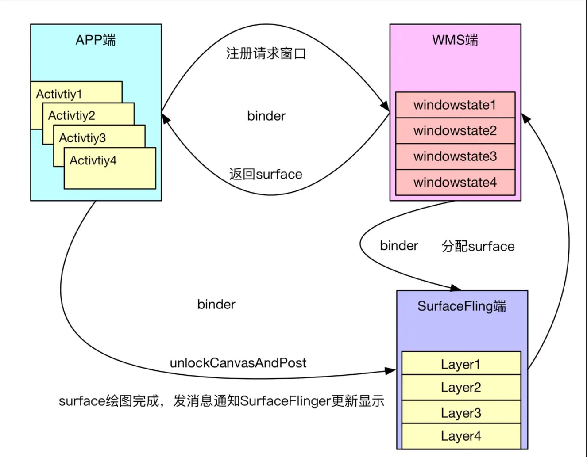
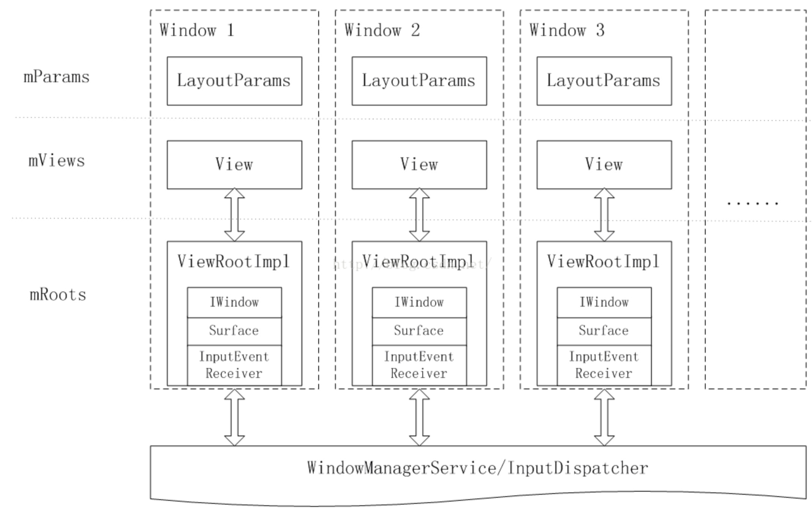
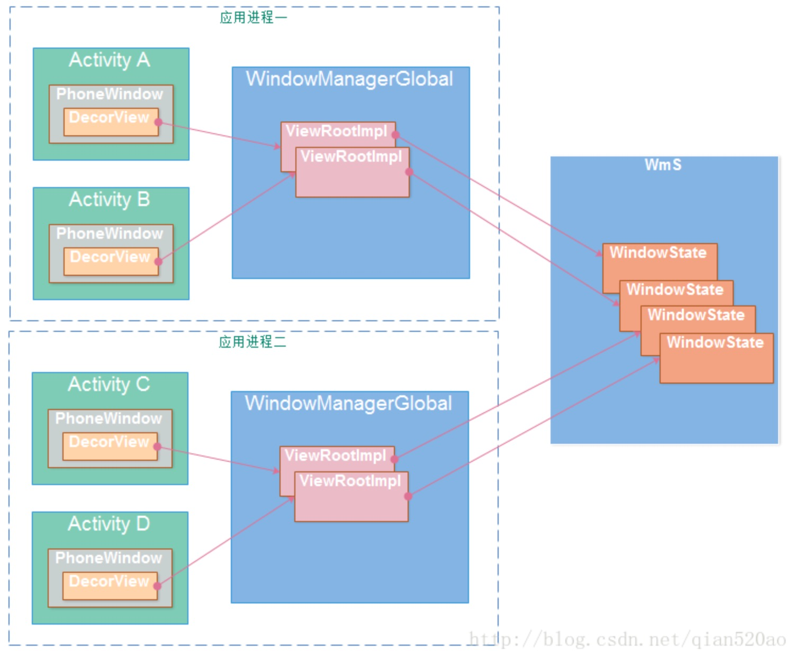

## UI刷新机制


## 窗口管理

### WMS - 窗口管理者，并不负责View绘制

```java
WMS其实只负责窗口管理，比如窗口的添加、移除、调整顺序等，还有负责窗口动画、Touch事件等。
至于图像的绘制与合成之类的都不是WMS管理的范畴，WMS更像在更高的层面对于Android窗口的一个抽象。
真正完成图像绘制的是App端，而完成图层合成的是SurfaceFlinger。

申请了依附窗口，View才会有可以绘制的目标内存。
当App端通过WindowManagerService的代理向其添加窗口的时候，WindowManagerService除了自己进行登记整理，还需要向SurfaceFlinger申请一块Surface画布，其实主要是画布背后所对应的一块内存，只有这一块内存申请成功之后，App端才有绘图的目标，绘制完成后通知SurfaceFlinger更新显示。
  
其实也可以从IWindowSession的binder通信接口看出来：
interface IWindowSession {
    int add(IWindow window, int seq, in WindowManager.LayoutParams attrs,
            in int viewVisibility, out Rect outContentInsets,
            out InputChannel outInputChannel);
            
    int addToDisplay(IWindow window, int seq, in WindowManager.LayoutParams attrs,
            in int viewVisibility, in int layerStackId, out Rect outContentInsets,
            out InputChannel outInputChannel);
            
    int relayout(IWindow window, int seq, in WindowManager.LayoutParams attrs,
            int requestedWidth, int requestedHeight, int viewVisibility,
            int flags, out Rect outFrame, out Rect outOverscanInsets,
            out Rect outContentInsets, out Rect outVisibleInsets,
            out Configuration outConfig, out Surface outSurface);
            
    void remove(IWindow window);
		...
}
```




### 窗口分组

```java
Android中的窗口主要分为三种：系统窗口、应用窗口、子窗口。

如果不知道窗口分组管理，可能有点迷糊，比如Dialog必须使用Activity的Context（一般情况下），PopupWindow不能作为父窗口（必须依附到其他窗口，依附的窗口可以是应用窗口也可以是系统窗口，但是不能是子窗口）等
 
Toast、PopupWindow、Dialog、Activity三者都有窗口的概念，但又各有不同，Toast属于系统窗口，PopupWindow属于子窗口，Activity、Dialog属于应用窗口。但是Dialog比较特殊，从表现上来说偏向于子窗口，必须依附Activity才能存在，但是从性质上来说，仍然是应用窗口，有自己的WindowToken。
```


### 窗口管理

#### 应用端相关类介绍

##### WindowManagerImpl

```java
//Window的使用：
WindowManager windowManager = (WindowManager) getSystemService(Service.WINDOW_SERVICE);
windowManager.addView(view, lp);

//WindowManagerImpl：就是 WindowManager 的实现：
//详情可查看：ContextImpl#getSystemService -> SystemServiceRegistry#getSystemService -> SYSTEM_SERVICE_FETCHERS.get(name)
//SystemServiceRegistry 有个静态代码块，进行了大量的registerService，其中包括WindowManager的
//registerService：加入 SYSTEM_SERVICE_FETCHERS 缓存
registerService(Context.WINDOW_SERVICE, WindowManager.class,
		new CachedServiceFetcher<WindowManager>() {
			@Override
			public WindowManager createService(ContextImpl ctx) {
				return new WindowManagerImpl(ctx);
			}});

public final class WindowManagerImpl implements WindowManager {
	private final WindowManagerGlobal mGlobal = WindowManagerGlobal.getInstance();
	...
  @Override
  public void addView(@NonNull View view, @NonNull ViewGroup.LayoutParams params) {
      ...
      //所有方法实现，都是转接到 WindowManagerGlobal
      mGlobal.addView(view, params, mContext.getDisplayNoVerify(), mParentWindow,
              mContext.getUserId());
  }
}
```


##### WindowManagerGlobal

```java
//WindowManagerGlobal：单例类
public final class WindowManagerGlobal {
  //WMS的Binder代理对象
	private static IWindowManager sWindowManagerService;
  //向WMS申请的WindowSession，也是一个Binder代理对象
	private static IWindowSession sWindowSession;
  
	private final ArrayList<View> mViews = new ArrayList<View>();
  private final ArrayList<ViewRootImpl> mRoots = new ArrayList<ViewRootImpl>();
  private final ArrayList<WindowManager.LayoutParams> mParams =
            new ArrayList<WindowManager.LayoutParams>();

   //WindowManagerGlobal#getWindowManagerService
   public static IWindowManager getWindowManagerService() {
          synchronized (WindowManagerGlobal.class) {
              if (sWindowManagerService == null) {
                  sWindowManagerService = IWindowManager.Stub.asInterface(
                          ServiceManager.getService("window"));
                  ...
              }
              return sWindowManagerService;
          }
      }

	 //WindowManagerGlobal#getWindowSession：获取WindowSession对象
   //每个应用进程仅有一个WindowSession对象，它对应了WMS中的Session子类，WMS为每一个应用进程分配一个Session对象。
   public static IWindowSession getWindowSession() {
        synchronized (WindowManagerGlobal.class) {
            if (sWindowSession == null) {
                try {
                    ...
                    IWindowManager windowManager = getWindowManagerService();
                    sWindowSession = windowManager.openSession(
                            new IWindowSessionCallback.Stub() {
                                @Override
                                public void onAnimatorScaleChanged(float scale) {
                                    ValueAnimator.setDurationScale(scale);
                                }
                            });
                } catch (RemoteException e) {
                    throw e.rethrowFromSystemServer();
                }
            }
            return sWindowSession;
        }
    }

   public void addView(View view, ViewGroup.LayoutParams params, Display display, Window parentWindow, int userId) {
          ...
          final WindowManager.LayoutParams wparams = (WindowManager.LayoutParams) params;
          //parentWindow不为空，还要包装点东西进 LayoutParams，例如填入parentWindow的token值之类的
     			if (parentWindow != null) { 
            	parentWindow.adjustLayoutParamsForSubWindow(wparams);
        	}
          ...
          ViewRootImpl root;
          ...
          synchronized (mLock) {
              ...
              //创建ViewRootImpl对象
              root = new ViewRootImpl(view.getContext(), display);

              view.setLayoutParams(wparams);
						  //缓存DecordView、ViewRootImpl、WindowManager.LayoutParams
              mViews.add(view);
              mRoots.add(root);
              mParams.add(wparams);

              try {
                  //ViewRootImpl#setView
                  root.setView(view, wparams, panelParentView, userId);
              } catch (RuntimeException e) { ... }
          }
      }
}
```


##### ViewRootImpl

```java
ViewRootImpl：可以看做是Window和View之间的通信的纽带
比如与WMS绑定、处理WMS传入的触摸事件、通知WMS更新窗口大小等、同时ViewRootImpl也封装了View的绘制与更新方法等
  
ViewRootImpl里边的两个属性：
final IWindowSession mWindowSession ：app持有WMS的Binder代理对象，通过它app可以向WMS发起调用
final W mWindow (W继承自IWindow.Stub) ：app传递给WMS的Binder代理对象，通过它WMS可以向app发起调用

public ViewRootImpl(Context context, Display display) {
		...
    mWindowSession = WindowManagerGlobal.getWindowSession(); //获取WindowSession
    mWindow = new W(this);
    ...
}

//Window#addView -> WindowManagerGlobal#addView（new ViewRootImpl & ViewRootImpl#setView）
//Window#addView的时候，就会创建一个ViewRootImpl，并且调用它的setView方法
public void setView(View view, WindowManager.LayoutParams attrs, View panelParentView) {
	...
	//首次请求绘制
	requestLayout();
	...
	//将 app端的Binder实体对象 IWindow.Stub 发布给WMS
	res = mWindowSession.addToDisplay(mWindow, mSeq, mWindowAttributes,
                            getHostVisibility(), mDisplay.getDisplayId(),
                            mAttachInfo.mContentInsets, mAttachInfo.mStableInsets,
                            mAttachInfo.mOutsets, mInputChannel);
    ...
}
```



#### Window与WMS的绑定过程

```java
//上边介绍ViewRootImpl的时候，ViewRootImpl#setView 会执行 mWindowSession#addToDisplay
//IWindowSession#addToDisplay -> ... -> WMS#addWindow

//WMS#addWindow
public int addWindow(Session session, IWindow client, int seq,
            WindowManager.LayoutParams attrs, int viewVisibility, int displayId,
            Rect outContentInsets, Rect outStableInsets, Rect outOutsets,
            InputChannel outInputChannel) {
        		...
        		synchronized(mWindowMap) {
        		...
            //防止重复添加相同的Window
            if (mWindowMap.containsKey(client.asBinder())) {
                return WindowManagerGlobal.ADD_DUPLICATE_ADD;
            }
            //对于子窗口类型的处理 1、必须有父窗口 2，父窗口不能是子窗口类型
            if (type >= FIRST_SUB_WINDOW && type <= LAST_SUB_WINDOW) {
                parentWindow = windowForClientLocked(null, attrs.token, false);
                if (parentWindow == null) {
                    return WindowManagerGlobal.ADD_BAD_SUBWINDOW_TOKEN;
                }
                if (parentWindow.mAttrs.type >= FIRST_SUB_WINDOW
                        && parentWindow.mAttrs.type <= LAST_SUB_WINDOW) {
                    return WindowManagerGlobal.ADD_BAD_SUBWINDOW_TOKEN;
                }}
           ...
            boolean addToken = false;
            //根据IWindow 获取WindowToken WindowToken是窗口分组的基础，每个窗口必定有一个分组
            WindowToken token = mTokenMap.get(attrs.token);
            //对于Toast类系统窗口，其attrs.token可以看做是null， 如果目前没有其他的类似系统窗口展示，token仍然获取不到，仍然要走新建流程
            if (token == null) {
            ...    
                token = new WindowToken(this, attrs.token, -1, false);
                addToken = true;
            } 
            ...
            //新建WindowState，WindowState与窗口是一对一的关系，可以看做是WMS中与窗口的抽象实体
            WindowState win = new WindowState(this, session, client, token,
                    attachedWindow, appOp[0], seq, attrs, viewVisibility, displayContent);
            ...
            if (addToken) {
                mTokenMap.put(attrs.token, token);
            }
            win.attach(); //会创建一个SurfaceSession，与SurfaceFlinger链接
              
            //mWindowMap是用来保存当前所有WindowState的集合
            mWindowMap.put(client.asBinder(), win);
              
            win.mToken.addWindow(win); //一个token下会有多个win state。 其实token与PhoneWindow是一一对应的。
            
            ... 
        return res;
    }
```


#### WMS的WindowState 

```java
WindowState表示一个窗口的所有属性，Window在WMS里边的以 WindowState对象 体现。
WMS会创建一个WindowState对象用来表示当前添加的窗口。WMS负责管理这里些WindowState对象。

查看WindowState的内容命令：
adb shell dumpsys window windows
  
WindowState与WindowToken的从属关系

例如：一个Activity包含有2个Dialog
Activity WindowToken
	Activity WindowState
	DialogA WindowState
	DialogB WindowState
```




#### WMS的Token

- 对于显示组件（客户端）而言，Token是一个Binder对象，对于它们来说仅仅是一个创建窗口的令牌，没有其他的含义。
- 对于WMS而言的WindowToken这是一个WindowToken类的实例，存储于mTokenMap中（key为Binder对象，value为WindowToken类的实例）。客户端的Token是否已被声明，取决于其对应的WindowToken是否位于mTokenMap中。


##### WindowToken

 WindowToken作用：

- WindowToken将属于同一个应用组件的窗口组织在了一起（（应用组件包括：Activity、InputMethod、Wallpaper以及Dream））。在WMS对窗口的管理过程中，用WindowToken指代一个应用组件。例如在进行窗口ZOrder排序时，属于同一个WindowToken的窗口会被安排在一起，而且在其中定义的一些属性将会影响所有属于此WindowToken的窗口。这些都表明了属于同一个WindowToken的窗口之间的紧密联系。
- WindowToken具有令牌的作用，是对应用组件的行为进行规范管理的一个手段。WindowToken由应用组件或其管理者负责向WMS声明并持有。应用组件在需要新的窗口时，必须提供WindowToken以表明自己的身份，并且窗口的类型必须与所持有的WindowToken的类型一致。从上面的代码可以看到，在创建系统类型的窗口时不需要提供一个有效的Token，WMS会隐式地为其声明一个WindowToken，看起来谁都可以添加个系统级的窗口。难道Android为了内部使用方便而置安全于不顾吗？非也，addWindow()函数一开始的mPolicy.checkAddPermission()的目的就是如此。它要求客户端必须拥有SYSTEM_ALERT_WINDOW或INTERNAL_SYSTEM_WINDOW权限才能创建系统类型的窗口。

WindowToken对象的创建分为：隐式创建 以及 显式创建

隐式创建：WindowToken对象由WMS创建，隐式创建的WindowToken对象当最后一个窗口被移除后，此WindowToken对象也会被一并从mTokenMap中移除。

显式创建：通过 addWindowToken(IBinder token, int type) 方法创建WindowToken对象，并且缓存进mTokenMap，key为参数token，value为一个 new WindowToken。移除只能通过 removeWindowToken() 显式地移除。

```java
class WindowToken {
     ...
       
    //变量token是IBinder对象，具有系统唯一性，因此向WMS的mWindowMap或者mTokenMap中插入对象时都是使用token值作为索引。
    final IBinder token;
  
    //变量windowType表示窗口类型
    final int windowType;
  
    //变量explicit为false表示Token是在WMS中创建的，为true表示其他模块通过addAppToken()或者addWindowToke()方法显示创建的。
    final boolean explicit;

    //成员变量windows的类型是WindowList,他包含一个WindowState对象的列表，所有拥有相同WindowToken的窗口都在这个列表中。
    final WindowList windows = new WindowList();
    ...
}
```


##### Token令牌从何而来 - 以Activity为例

###### Activity Token令牌以及WindowToken的创建过程（AMS与WMS交互）

```java
//在Activity的启动流程中，AMS会执行这样的逻辑：
//AMS ActivityStack#startActivityLocked
private final void startActivityLocked(...) {
    ...
    //AMS调用了WMS addAppToken 方法，传入ActivityRecord#appToken（令牌），显示创建WindowToken对象
    //WMS#addAppToken：mTokenMap.put(token.asBinder(), new WindowToken(...));
    mService.mWindowManager.addAppToken(addPos,r.appToken, r.task.taskId,
                               r.info.screenOrientation, r.fullscreen);
    ...
}

//AMS ActivityRecord构造函数：创建Token令牌
class ActivityRecord extends WindowToken implements WindowManagerService.AppFreezeListener {
  
	private ActivityRecord(...) {
    //ActivityRecord继承自WindowToken
    //WindowToken(WindowManagerService service, IBinder _token, int type, ...)
    //_token传参，会赋值给 WindowToken#token
		super(_service.mWindowManager, new Token(_intent).asBinder(), TYPE_APPLICATION, true, null, false);
		...
    //将WindowToken#token令牌赋值给 appToken
    //Token是个内部类，继承自IApplicationToken.Stub
		appToken = (Token) token;
		...
	}
  
  /* 大部分是WindowManagerService用于通知ActivityManagerService的关于Window的消息
  interface IApplicationToken{
    void windowsDrawn(); //当窗口完成初次绘制后通知AMS
    void windowsVisible(); //当窗口可见时通知AMS
    void windowsGone(); //当窗口不可见时通知AMS
    boolean keyDispatchingTimedOut(String reason); //窗口没能按时完成输入事件的处理。这个回调将会导致ANR。
    long getKeyDispatchingTimeout(); //从AMS处获取界定ANR的时间。
	}
	*/
  static class Token extends IApplicationToken.Stub {
        private WeakReference<ActivityRecord> weakActivity;
        ...

        Token(Intent intent) {
            name = intent.getComponent().flattenToShortString();
            ...
        }

        private void attach(ActivityRecord activity) {
            ...
            weakActivity = new WeakReference<>(activity);
        }

        ...
    }
}
```


###### AMS将Activity Token令牌传递给app端

```java
//AMS通知app端启动Activity的时候，会把Token令牌传过来
app.thread.scheduleLaunchActivity(new Intent(r.intent), r.appToken, ...);

//app端
public final void scheduleLaunchActivity(Intent intent, IBinder token, ...) {
     //创建一个ActivityClientRecord对象，将AMS中的token保存到 ActivityClientRecord中
     ActivityClientRecord r = new ActivityClientRecord();
     r.token = token;
}

//app端 ActivityThread 会维护着 ActivityClientRecord容器
public final class ActivityThread {
    ...
    //key为token令牌，value为ActivityClientRecord对象
    final ArrayMap<IBinder, ActivityClientRecord> mActivities = new ArrayMap<>();
    ...
}
```


### 面试问题

#### 1、创建dialog所需的Context必须是Activity吗

##### 问题解答

```java
不一定必须是Activity的。
  
满足以下两个条件可以使用Application、Service启动来启动Dialog
1、拥有 SYSTEM_ALERT_WINDOW 权限
2、Dialog的Window的type指定为 SYSTEM_WINDOW 类型（系统窗口类型），比如 TYPE_SYSTEM_ALERT 或 TYPE_APPLICATION_OVERLAY

否则会报错：BadTokenException(token null is not valid; is your activity running?)
```


##### 分析 - 为什么传入Activity的Context能显示Dialog?

```java
总结：
1、Activity继承自Context，有重写了 getSystemService 方法
2、如果是获取 WindowManager，则会返回 Activity提前创建好的 WindowManager 对象
3、Activity创建的 WindowManager 对象的 parentWindow是不为空的，就是Activity自己的Window对象
4、当 Dialog用过该 WindowManager 对象，走addView逻辑的时候，会判断 parentWindow 是否为空的，如果不为空，则
会将 parentWindow的LayoutParams里边的token填入到 Dialog LayoutParams里边，最后传递WMS
5、至此，该Dialog就会属于该Activity的窗口组了。
  
源码分析：
//Dialog跟Activity一样，都是Window机制。所以都需要走 WindowManager#addView。关键就是WindowManager对象。
Dialog(Context context, ...) {
    ...
    //通过getSystemService获取WindowManager
    mWindowManager = (WindowManager) context.getSystemService(Context.WINDOW_SERVICE);
    final Window w = new PhoneWindow(mContext);
    mWindow = w;
    ...
}

//如果这个Context是Activity的话，Activity有重写getSystemService方法的，name 为 WINDOW_SERVICE 的话会返回带有这个Activity的Token的WindowManager对象
//Token：WMS需要根据这个Token来确定Window的位置（不是说坐标），如果没有Token的话，就不知道这个窗口应该放到哪个容器上了
//Activity#getSystemService
public Object getSystemService(@ServiceName @NonNull String name) {
		...
		if (WINDOW_SERVICE.equals(name)) {
			return mWindowManager;
    }
		...
		return super.getSystemService(name);
}

//Activity#attach mWindowManager是在这里创建的
//这里看到 mWindowManager 是 PhoneWindow#getWindowManager 获取的 
//而 PhoneWindow#getWindowManager 
final void attach(Context context, ..., IBinder token, ...) {
        ...
        mWindow = new PhoneWindow(this, window, activityConfigCallback);
        ...
        mToken = token;
        ...
        //创建PhoneWindow自己的WindowManager
        mWindow.setWindowManager(
                (WindowManager)context.getSystemService(Context.WINDOW_SERVICE),
                mToken, mComponent.flattenToString(),
                (info.flags & ActivityInfo.FLAG_HARDWARE_ACCELERATED) != 0);
        ...
        //返回刚刚PhoneWindow自己创建的WindowManager
        mWindowManager = mWindow.getWindowManager();
        ...
    }

	//Window#setWindowManager
	public void setWindowManager(WindowManager wm, IBinder appToken, String appName,
            boolean hardwareAccelerated) {
        mAppToken = appToken;
        mAppName = appName;
        mHardwareAccelerated = hardwareAccelerated;
        if (wm == null) {
            wm = (WindowManager)mContext.getSystemService(Context.WINDOW_SERVICE);
        }
        //createLocalWindowManager并且传入自己这个Window对象
        mWindowManager = ((WindowManagerImpl)wm).createLocalWindowManager(this);
    }

	 //Window#createLocalWindowManager：这里创建的WindowManagerImpl是有Parent Window的
   //也就是说Activity创建的WindowManagerImpl对象，是带Parent Window的。这个Parent Window就是Activity自己的PhoneWindow
   public WindowManagerImpl createLocalWindowManager(Window parentWindow) {
       return new WindowManagerImpl(mContext, parentWindow);
   }

//WindowManager#addView -> WindowManagerGlobal#addView
public void addView(View view, ViewGroup.LayoutParams params, Display display, Window parentWindow, int userId) {
          ...
          final WindowManager.LayoutParams wparams = (WindowManager.LayoutParams) params;
          //parentWindow不为空，还要包装点东西进 LayoutParams（例如parentWindow的token值之类）
     			if (parentWindow != null) { 
              parentWindow.adjustLayoutParamsForSubWindow(wparams);
        	}
  			  ...
          ViewRootImpl root;
          ...
          synchronized (mLock) {
              ...
              //创建ViewRootImpl对象
              root = new ViewRootImpl(view.getContext(), display);
              view.setLayoutParams(wparams);
						  //缓存DecordView、ViewRootImpl、WindowManager.LayoutParams
              mViews.add(view);
              mRoots.add(root);
              mParams.add(wparams);
              try {
                  //ViewRootImpl#setView
                  root.setView(view, wparams, panelParentView, userId);
              } catch (RuntimeException e) { ... }
          }
      }
}

//Window#adjustLayoutParamsForSubWindow：注意 parentWindow.adjustLayoutParamsForSubWindow(wparams); //用过parentWindow对象调用该方法的
//这里wp传参是Dialog Window的LayoutParams（并不是parentWindow的LayoutParams）所以token肯定是null的。
void adjustLayoutParamsForSubWindow(WindowManager.LayoutParams wp) {
        CharSequence curTitle = wp.getTitle();
        if (wp.type >= WindowManager.LayoutParams.FIRST_SUB_WINDOW && wp.type <= WindowManager.LayoutParams.LAST_SUB_WINDOW) {
            ...
        } else if (wp.type >= WindowManager.LayoutParams.FIRST_SYSTEM_WINDOW && wp.type <= WindowManager.LayoutParams.LAST_SYSTEM_WINDOW) {
            ...
        } else {
            if (wp.token == null) { //将parentWindow的token赋值给Dialog Window的LayoutParams
                wp.token = mContainer == null ? mAppToken : mContainer.mAppToken;
            }
            ...
        }
        ...
    }
```


##### 分析 - 为什么系统窗口类型的Dialog不需要Token也能显示？

```java
没有Token令牌，WMS就无法找到该窗口所属的窗口组。
但是如果是系统窗口类型，并且有响应的权限。
WMS会为其隐式创建一个WindowToken对象，为它开辟一个窗口组。不过当该窗口组里边的窗口都被移除了后，该窗口组也会被WMS给移除掉。
```


#### 2、PopupWindow 与 Dialog区别是什么

```java
1、窗口类型不一样。
   PopupWindow是属于子窗口类型，必须依附到其他非子窗口上。而Dialog一个应用窗口类型。
2、PopupWindow并没有自己的Window对象。
   Activity、Dialog都会创建自己的Window对象（PhoneWindow）
   而PopupWindow没有，是直接通过 WindowManager#addView 添加一个View上去了。（也就没法设置callback，无法消费事件，也就是说PopupWindow弹出后可以继续与依赖的Activity进行交互的原因）
```


#### 3、说说Toast的窗口机制

```java
Toast受NotificationManagerService服务来管理。
当调用show方法后，Toast就会加入到 NotificationManagerService#mToastQueue消息队列里排队等候显示。
  
Toast的显示交由远程的NotificationManagerService管理是因为Toast是每个应用程序都会弹出的，而且位置和UI风格都差不多，所以如果我们不统一管理就会出现覆盖叠加现象，同时导致不好控制，所以把Toast设计成为了系统级的窗口类型，由NotificationManagerService统一队列管理。
```


## 屏幕绘制

### SurfaceFlinger - 负责图层的混合，并将结果传输给硬件显示

todo


