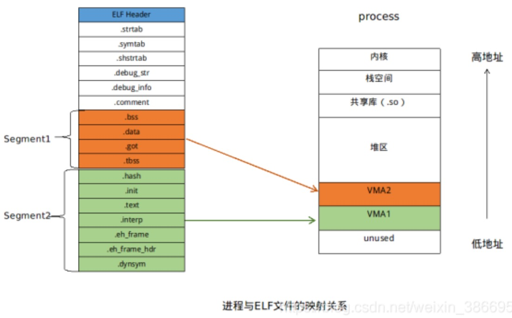
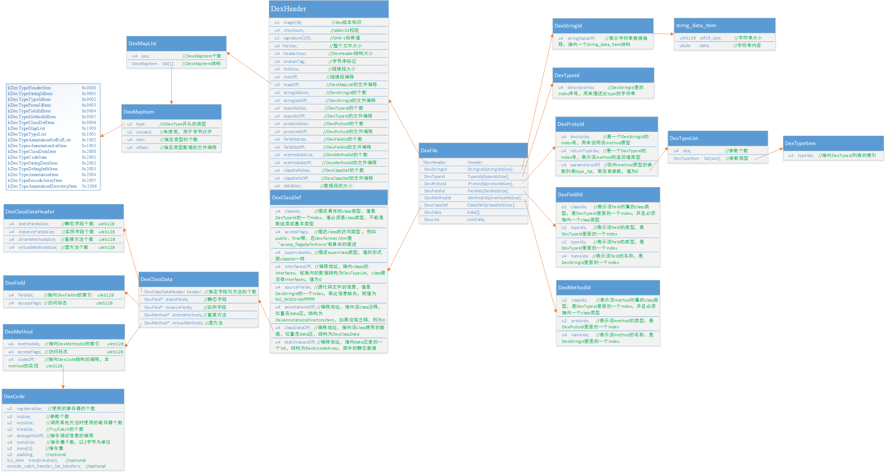
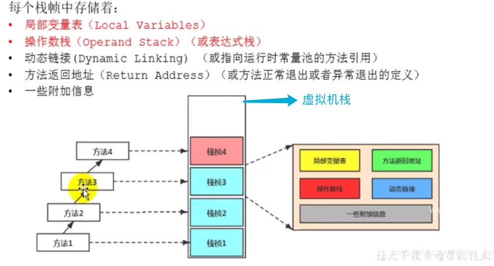

## elf文件学习

### 概要

```java
ELF：Executable and Linkable Format的缩写，其中的“Executable”和“Linkable”表明ELF文件有两种重要的特性。
Executable：可执行。ELF文件将参与程序的执行（Execution）工作。包括二进制程序的运行以及动态库.so文件的加载。Linkable：可链接。ELF文件是编译链接工作的重要参与者。
  
  
Linking View：链接视图，它是从编译链接的角度（可重定位文件）来观察一个ELF文件应该包含什么内容。
Execution View：执行视图，它是从执行的角度（可执行文件或动态库文件）来观察一个ELF文件应该包含什么信息。
  
  
ELF文件的三种类型
1、可重定位的文件(Relocatable file) - .o文件（符号为ET_REL）
	 可执行文件里面包含了可以运行的程序代码
	 汇编器汇编生成的.o文件（只编译不链接的文件）。经链接处理后，可生成 一个可执行文件 或 一个共享文件。
  
2、可执行得文件(Executable file) - 可执行文件（符号为ET_EXEC）
   可执行文件里面包含了可以运行的程序代码 
  
3、可被共享的文件(Shared object file) - .so文件（符号为ET_DYN）
   动态库文件里面也包含了可用于链接的代码和程序。


由汇编程序和链接编辑器生成的目标文件是可以在CPU上执行的二进制表示程序。
目标文件统一遵守ELF格式。但是不同的系统架构，ELF里面的格式和数据处理方式会略有不同。
但是基本上格式如下：

可重定向文件的格式：Header + Sections（节数组） + Section Header Table
可执行文件的格式：Header + Segments（段数组） + Program Header Table
 	可重定向文件中的节（Section）和可执行文件中的段（Segment）都是存储了程序的代码部分、数据部分等。
 	区别是可执行目标文件中的某个段就是结合了很多可重定向目标文件中的相关节。
```


### 常用命令

```java
Header查看：readelf -h 目标文件
Section Header Table查看：readelf -S 目标文件
Program Header Table查看：readelf -l 目标文件
  
某个Section的查看：readelf -x Section名 目标文件
符号表查看：readelf -s 目标文件
```


### ELF Header

```java
ELF Header:
  Magic:   7f 45 4c 46 02 01 01 00 00 00 00 00 00 00 00 00 
  Class:                             ELF64
  Data:                              2's complement, little endian
  Version:                           1 (current)
  OS/ABI:                            UNIX - System V
  ABI Version:                       0
  Type:                              DYN (Shared object file)
  Machine:                           AArch64
  Version:                           0x1
  Entry point address:               0x690 //入口点地址
  Start of program headers:          64 (bytes into file) //程序头起点
  Start of section headers:          24328 (bytes into file)
  Flags:                             0x0
  Size of this header:               64 (bytes) //本头的大小
  Size of program headers:           56 (bytes) //程序头大小
  Number of program headers:         8
  Size of section headers:           64 (bytes) //节头大小
  Number of section headers:         30 //节头数量
  Section header string table index: 27 //字符串表索引节头
```


### Section 与 Segment 的区别

```java
可执行文件和动态库文件由多个Segment + 程序头表组成
  
Segment可以看作是多个.o文件中的相似Section的合并，即一个Segment包含一个或多个属性相似的Section
  
这里的属性相似更多是指权限，比如链接器会把多个.o文件中的都具有可读可执行的.text和.init段都放在最终可执行文件中的一个Segment内，这样的好处就是可以更多的节省内存空间。这个原因是由于ELF文件被加载时，是以系统的页长度为单位，如果一个Segment的长度小于一个页大小，那么这个Segment也要占据整个页大小。连接器对具有相同权限的段Section合并到一个段Segment后，就可以尽可能的减少内存碎片。
```


### Linking View下的ELF（Section Header Table）

```java
There are 30 section headers, starting at offset 0x5f08: //30个节，从偏移量 0x5f08 开始

Section Headers:
  //Name：Section名，就是个字符串，每个Section功能都不同，比如.text存放代码、.data存放数据
  //Type：Section类型
  //Address：Section被加载到进程中的虚拟地址，由于还没加载所有都是0。
  //Offset：Section在ELF文件中的偏移
  //Size：Section的大小
  //EntSize：某些节区中包含固定大小的项目，如符号表。对于这类节区，此成员给出每个表项的长度字节数。
  //Flags：进程虚拟空间中的属性，是否可读、可写、可执行。比如代码段.text的标志位为AX代表alloc+execute，表示该段需要在内存开辟空间并且权限为可执行。
  //Link & Info：具体含义依赖于依赖于Type，Link此成员给出节区头部表索引链接，Info此成员给出附加信息
  //Align：就指定了对齐方式。比如.text段的Align值为16就代表该段在内存的必须以16对齐存放，即存放该段的内存起始地址必须可以被16整除。
  [Nr] Name              Type             Address           Offset
       Size              EntSize          Flags  Link  Info  Align
    
  [ 0]                   NULL             0000000000000000  00000000
       0000000000000000  0000000000000000           0     0     0
  [ 1] .note.gnu.build-i NOTE             0000000000000200  00000200
       0000000000000024  0000000000000000   A       0     0     4
  [ 2] .hash             HASH             0000000000000228  00000228
       0000000000000054  0000000000000004   A       4     0     8
  [ 3] .gnu.hash         GNU_HASH         0000000000000280  00000280
       000000000000004c  0000000000000000   A       4     0     8
  [ 4] .dynsym           DYNSYM           00000000000002d0  000002d0
       0000000000000180  0000000000000018   A       5     3     8
  [ 5] .dynstr           STRTAB           0000000000000450  00000450
       00000000000000cb  0000000000000000   A       0     0     1
  [ 6] .gnu.version      VERSYM           000000000000051c  0000051c
       0000000000000020  0000000000000002   A       4     0     2
  [ 7] .gnu.version_r    VERNEED          0000000000000540  00000540
       0000000000000020  0000000000000000   A       5     1     8
  [ 8] .rela.dyn         RELA             0000000000000560  00000560
       0000000000000048  0000000000000018   A       4     0     8
  [ 9] .rela.plt         RELA             00000000000005a8  000005a8
       0000000000000078  0000000000000018  AI       4    19     8
  [10] .plt              PROGBITS         0000000000000620  00000620
       0000000000000070  0000000000000010  AX       0     0     16
  [11] .text             PROGBITS         0000000000000690  00000690
       0000000000000244  0000000000000000  AX       0     0     4
  [12] .rodata           PROGBITS         00000000000008d4  000008d4
       000000000000003f  0000000000000001 AMS       0     0     1
  [13] .eh_frame_hdr     PROGBITS         0000000000000914  00000914
       0000000000000024  0000000000000000   A       0     0     4
  [14] .eh_frame         PROGBITS         0000000000000938  00000938
       0000000000000078  0000000000000000   A       0     0     8
  [15] .note.android.ide NOTE             00000000000009b0  000009b0
       0000000000000098  0000000000000000   A       0     0     4
  [16] .fini_array       FINI_ARRAY       0000000000001db0  00000db0
       0000000000000010  0000000000000008  WA       0     0     8
  [17] .data.rel.ro      PROGBITS         0000000000001dc0  00000dc0
       0000000000000008  0000000000000000  WA       0     0     8
  [18] .dynamic          DYNAMIC          0000000000001dc8  00000dc8
       00000000000001f0  0000000000000010  WA       5     0     8
  [19] .got              PROGBITS         0000000000001fb8  00000fb8
       0000000000000048  0000000000000008  WA       0     0     8
  [20] .comment          PROGBITS         0000000000000000  00001000
       00000000000000b5  0000000000000001  MS       0     0     1
  [21] .debug_info       PROGBITS         0000000000000000  000010b5
       0000000000002978  0000000000000000           0     0     1
  [22] .debug_abbrev     PROGBITS         0000000000000000  00003a2d
       0000000000000151  0000000000000000           0     0     1
  [23] .debug_line       PROGBITS         0000000000000000  00003b7e
       00000000000002ef  0000000000000000           0     0     1
  [24] .debug_str        PROGBITS         0000000000000000  00003e6d
       0000000000001597  0000000000000001  MS       0     0     1
  [25] .debug_macinfo    PROGBITS         0000000000000000  00005404
       0000000000000001  0000000000000000           0     0     1
  [26] .debug_ranges     PROGBITS         0000000000000000  00005405
       0000000000000040  0000000000000000           0     0     1
  [27] .shstrtab         STRTAB           0000000000000000  00005dd3
       0000000000000130  0000000000000000           0     0     1
  [28] .symtab           SYMTAB           0000000000000000  00005448
       0000000000000768  0000000000000018          29    66     8
  [29] .strtab           STRTAB           0000000000000000  00005bb0
       0000000000000223  0000000000000000           0     0     1
Key to Flags:
  W (write), A (alloc), X (execute), M (merge), S (strings), I (info),
  L (link order), O (extra OS processing required), G (group), T (TLS),
  C (compressed), x (unknown), o (OS specific), E (exclude),
  p (processor specific)
```


#### Section Type

| 类型     | 含义                                                         |
| -------- | ------------------------------------------------------------ |
| NULL     | 无效段，忽略                                                 |
| PROGBITS | 程序段。包括代码段、数据段、调试信息等，对应的段名有.text .data .pdr .common等。 |
| SYMTAB   | 符号表段。对应的段名是.symtab，里面存放了链接过程需要的所有符号信息。后面有详细介绍。 |
| STRTAB   | 字符串表段。包括.strtab和.shstrtab。.strtab用来保存ELF文件中一般的字符串，如变量名、函数名等。.shstrtab用于保存段表中用到的字符串，如段名Name。 |
| RELA     | 重定位表段 （with explicit addends）。存放那些代码段和数据段中有绝对地址引用的相关信息，用于链接器的重定位。对应的段名有.rela.text .rela.data等 |
| HASH     | 符号表的哈希表                                               |
| DYNAMIC  | 动态链接信息                                                 |
| NOTE     | 提示性信息                                                   |
| NOBITS   | 表示该段在文件中无内容，比如.bss段                           |
| REL      | 重定位表段（without explicit addends）。对应的段名有.rel.text .rel.data等 |
| SHLIB    | 保留                                                         |
| DNYSYM   | 动态链接的符号表                                             |


#### 常见的Section简介

| Section名          | 描述                                                         |
| ------------------ | ------------------------------------------------------------ |
| .text              | 常称为代码段，用于存放程序的可执行机器指令                   |
| .data 和.data1     | 数据段，用于存放程序中已经初始化的数据                       |
| .rodata和 .rodata1 | 只读数据段，用于存放只读数据，如const类型变量和字符串常量    |
| .bss               | 用于存放未初始化的全局变量和局部静态变量                     |
| .common            | 用于存放编译器的版本信息                                     |
| .hash              | 符号哈希表                                                   |
| .dynamic           | 动态链接信息                                                 |
| .strtab            | 字符串表，用来存放变量名、函数名等字符串。                   |
| .symtab            | 符号表，用于保存变量、函数等符号值。                         |
| .shstrtab          | 段名表，用于保存段名信息，如“.text” “.data”等                |
| .plt 和 .got       | 动态链接的跳转表和全局入口表。got保存了全局偏移表，.got和.plt一起提供了对导入的共享库函数的访问入口，由动态链接器在运行时进行修改。 |
| .init 和 .fini     | 程序初始化和终结代码段                                       |


### Execution View下的ELF（Program Header Table）

```java
Elf file type is DYN (Shared object file) //Elf文件类型为共享文件
Entry point 0x690 //入口地址 0x690
There are 8 program headers, starting at offset 64 //有8个段，偏移量64

Program Headers:
//Type：段类型分为LOAD、DYNAMIC、NOTE、NULL等。LOAD类型的Segment是需要被加载到内存的。
//Offset：此段在ELF文件中的偏移
//VirtAddr：此段在进程内存中的起始地址，由于没加载到内存所有都是0
//FileSiz：此段在ELF文件所占的大小
//PhysAddr：此段的物理地址。对于可执行文件和动态库文件而言这个值并没有意义，因为系统用的是虚拟地址，不会使用物理地址。
//MemSiz：此Segment在进程内存中所占的长度
//Flags：权限属性包括可读R、可写W和可执行X
//Align：此段在内存加载时的对齐方式。其值为2的Align次方。比如上面的Align值为4，那么对齐要求就是16。
  Type           Offset             VirtAddr           PhysAddr
                 FileSiz            MemSiz              Flags  Align
  LOAD           0x0000000000000000 0x0000000000000000 0x0000000000000000
                 0x0000000000000a48 0x0000000000000a48  R E    1000
  LOAD           0x0000000000000db0 0x0000000000001db0 0x0000000000001db0
                 0x0000000000000250 0x0000000000000250  RW     1000
  DYNAMIC        0x0000000000000dc8 0x0000000000001dc8 0x0000000000001dc8
                 0x00000000000001f0 0x00000000000001f0  RW     8
  NOTE           0x0000000000000200 0x0000000000000200 0x0000000000000200
                 0x0000000000000024 0x0000000000000024  R      4
  NOTE           0x00000000000009b0 0x00000000000009b0 0x00000000000009b0
                 0x0000000000000098 0x0000000000000098  R      4
  GNU_EH_FRAME   0x0000000000000914 0x0000000000000914 0x0000000000000914
                 0x0000000000000024 0x0000000000000024  R      4
  GNU_STACK      0x0000000000000000 0x0000000000000000 0x0000000000000000
                 0x0000000000000000 0x0000000000000000  RW     10
  GNU_RELRO      0x0000000000000db0 0x0000000000001db0 0x0000000000001db0
                 0x0000000000000250 0x0000000000000250  R      1

 Section to Segment mapping:
  Segment Sections...
   00     .note.gnu.build-id .hash .gnu.hash .dynsym .dynstr .gnu.version .gnu.version_r .rela.dyn .rela.plt .plt .text .rodata .eh_frame_hdr .eh_frame .note.android.ident 
   01     .fini_array .data.rel.ro .dynamic .got 
   02     .dynamic 
   03     .note.gnu.build-id 
   04     .note.android.ident 
   05     .eh_frame_hdr 
   06     
   07     .fini_array .data.rel.ro .dynamic .got 
```


#### 可执行文件与进程虚拟空间映射关系



```java
ELF格式的文件在映射入进程时，ELF头和一个调试信息是不再需要的。只需要加载部分段（Segment）到内存，具体就是加载类型为LOAD的段即可。
VMA（Virtual Memorry Area）即虚拟地址空间。
  
实际开发中，我们还可以通过 /proc/pid/maps 来查看一个进程的虚拟空间分布

root@x86:/ # cat /proc/1427/maps
...
a24f0000-a2bff000 r--p 00000000 08:13 5931027    /data/app/com.llk.jni-1/oat/x86/base.odex
a2bff000-a2c00000 rw-p 0070f000 08:13 5931027    /data/app/com.llk.jni-1/oat/x86/base.odex
...
b720f000-b7304000 r-xp 00000000 08:06 1299       /system/lib/libc.so
b7304000-b7305000 ---p 00000000 00:00 0 
b7305000-b7309000 r--p 000f5000 08:06 1299       /system/lib/libc.so
b7309000-b730c000 rw-p 000f9000 08:06 1299       /system/lib/libc.so
b730c000-b7318000 rw-p 00000000 00:00 0 
b7318000-b73fc000 r-xp 00000000 08:06 1298       /system/lib/libc++.so
b73fc000-b73fd000 ---p 00000000 00:00 0 
b73fd000-b7401000 r--p 000e4000 08:06 1298       /system/lib/libc++.so
b7401000-b7402000 rw-p 000e8000 08:06 1298       /system/lib/libc++.so
b7402000-b7403000 rw-p 00000000 00:00 0 
...
  
b720f000-b7304000：VMA的地址范围
r-xp：WMA的权限，分为可读r、可写w、可执行x、私有p、可共享s
00000000：WMA对应的Segment在映射文件中的偏移
08:06：表示映像文件所在设备的主设备号和次设备号
1299：映像文件的节点号
/system/lib/libc.so：映像文件的路径
```


### .dynsym & .symtab Section（符号表）

#### 什么是符号（Symbol）

```java
在链接器中，函数和变量统称为符号（Symbol）,函数名和变量名称为符号名（Symbol Name）。符合可以分为如下种类：
1、局部符号：类似于函数内部定义的静态局部变量，类似于下面的变量a,b。这类符号只在编译单元内部可见。
int fun(){
 static int a,b;
}

2、全局符号：定义在本目标文件的全局符号，可以被其他文件引用。例如下面的global_var 、main：
int global_var;
int main(int arg ,char* arg[]){}

3、外部符号(External Symbol)：在本目标文件中引用的全局符号。比如我们经常使用的printf函数，它是定义在模块libc内的符号。
```


#### 符号表长什么样

```java
Symbol table '.dynsym' contains 16 entries: //.dynsym有16个符号
//Name：最后一列。没有名字的符号是段，从列Type的SECTION可以看出。
//Value：每个符号都有一个对应的值，如果此符号是一个函数、变量，那么符号的值就是函数和变量的地址。可执行文件 或 动态文件中，符号值可能是符号的虚拟地址、符号所在函数偏移等。
//Size：对于变量，符号大小是数据类型的大小，比如int变量的size为4。对于函数，符号大小是该函数中所有指令的字节数

/* Type：符号类型
NOTYPE：未知符号类型
OBJECT：表示该符号是个数据对象，比如变量、数组等。
FUNC：表示该符号是个函数或其他可执行代码。
SECTION：表示该符号为一个段。
FILE：该符号表示文件名。*/

/* Bind：符号绑定信息种类
LOCAL：局部符号。
GLOBAL：全局符号，如上面定义的全局变量global_var、函数main、printf
WEAK：弱引用符号。在这里没有体现。对于C/C++语言，编译器默认函数和已经初始化的全局变量为强符号。而未初始化的全局变量和使用__attribute__((weak))定义的变量为弱符号。 */

/* Ndx：符号所在段，如果符号定义在本目标文件中，那么这个成员表示符号所在的段在段表中的下标。Ndx还有如下特殊值：
UND：就表示这是个外部符号，不再本目标文件中定义
ABS：表示该符号包含了一个绝对值
COM：表示该符号是个未初始化的全局符号。*/
   Num:    Value          Size Type    Bind   Vis      Ndx Name
     0: 0000000000000000     0 NOTYPE  LOCAL  DEFAULT  UND 
     1: 0000000000000690     0 SECTION LOCAL  DEFAULT   11 
     2: 0000000000001dc0     0 SECTION LOCAL  DEFAULT   17 
     3: 0000000000000000     0 FUNC    GLOBAL DEFAULT  UND __cxa_finalize@LIBC (2)
     4: 0000000000000000     0 FUNC    GLOBAL DEFAULT  UND __stack_chk_fail@LIBC (2)
     5: 0000000000000000     0 FUNC    GLOBAL DEFAULT  UND __cxa_atexit@LIBC (2)
     6: 0000000000002000     0 NOTYPE  GLOBAL DEFAULT  ABS _bss_end__
     7: 0000000000002000     0 NOTYPE  GLOBAL DEFAULT  ABS _edata
     8: 0000000000002000     0 NOTYPE  GLOBAL DEFAULT  ABS _end
     9: 0000000000002000     0 NOTYPE  GLOBAL DEFAULT  ABS __bss_start
    10: 0000000000002000     0 NOTYPE  GLOBAL DEFAULT  ABS __bss_end__
    11: 00000000000006cc   172 FUNC    GLOBAL DEFAULT   11 doJavaHookInit
    12: 0000000000000778   172 FUNC    GLOBAL DEFAULT   11 doJavaHookFunction
    13: 0000000000000824   176 FUNC    GLOBAL DEFAULT   11 JNI_OnLoad
    14: 0000000000002000     0 NOTYPE  GLOBAL DEFAULT  ABS __end__
    15: 0000000000002000     0 NOTYPE  GLOBAL DEFAULT  ABS __bss_start__

Symbol table '.symtab' contains 79 entries: //.symtab有79个符号
   Num:    Value          Size Type    Bind   Vis      Ndx Name
     0: 0000000000000000     0 NOTYPE  LOCAL  DEFAULT  UND 
     1: 0000000000000200     0 SECTION LOCAL  DEFAULT    1 
     2: 0000000000000228     0 SECTION LOCAL  DEFAULT    2 
     3: 0000000000000280     0 SECTION LOCAL  DEFAULT    3 
     4: 00000000000002d0     0 SECTION LOCAL  DEFAULT    4 
     5: 0000000000000450     0 SECTION LOCAL  DEFAULT    5 
     6: 000000000000051c     0 SECTION LOCAL  DEFAULT    6 
     7: 0000000000000540     0 SECTION LOCAL  DEFAULT    7 
     8: 0000000000000560     0 SECTION LOCAL  DEFAULT    8 
     9: 00000000000005a8     0 SECTION LOCAL  DEFAULT    9 
    10: 0000000000000620     0 SECTION LOCAL  DEFAULT   10 
    11: 0000000000000690     0 SECTION LOCAL  DEFAULT   11 
    12: 00000000000008d4     0 SECTION LOCAL  DEFAULT   12 
    13: 0000000000000914     0 SECTION LOCAL  DEFAULT   13 
    14: 0000000000000938     0 SECTION LOCAL  DEFAULT   14 
    15: 00000000000009b0     0 SECTION LOCAL  DEFAULT   15 
    16: 0000000000001db0     0 SECTION LOCAL  DEFAULT   16 
    17: 0000000000001dc0     0 SECTION LOCAL  DEFAULT   17 
    18: 0000000000001dc8     0 SECTION LOCAL  DEFAULT   18 
    19: 0000000000001fb8     0 SECTION LOCAL  DEFAULT   19 
    20: 0000000000000000     0 SECTION LOCAL  DEFAULT   20 
    21: 0000000000000000     0 SECTION LOCAL  DEFAULT   21 
    22: 0000000000000000     0 SECTION LOCAL  DEFAULT   22 
    23: 0000000000000000     0 SECTION LOCAL  DEFAULT   23 
    24: 0000000000000000     0 SECTION LOCAL  DEFAULT   24 
    25: 0000000000000000     0 SECTION LOCAL  DEFAULT   25 
    26: 0000000000000000     0 SECTION LOCAL  DEFAULT   26 
    27: 0000000000000000     0 FILE    LOCAL  DEFAULT  ABS /buildbot/tmp/crtbrand-7a
    28: 00000000000009b0     0 NOTYPE  LOCAL  DEFAULT   15 $d.0
    29: 0000000000000a08     0 NOTYPE  LOCAL  DEFAULT   15 ndk_build_number
    30: 00000000000009c8     0 NOTYPE  LOCAL  DEFAULT   15 ndk_version
    31: 00000000000009b0   152 OBJECT  LOCAL  DEFAULT   15 note_android_ident
    32: 00000000000009c4     0 NOTYPE  LOCAL  DEFAULT   15 note_data
    33: 0000000000000a48     0 NOTYPE  LOCAL  DEFAULT   15 note_end
    34: 00000000000009bc     0 NOTYPE  LOCAL  DEFAULT   15 note_name
    35: 0000000000000000     0 FILE    LOCAL  DEFAULT  ABS crtbegin_so.c
    36: 0000000000001dc0     0 NOTYPE  LOCAL  DEFAULT   17 $d.1
    37: 0000000000001db0     0 NOTYPE  LOCAL  DEFAULT   16 $d.2
    38: 0000000000001db8     0 NOTYPE  LOCAL  DEFAULT   16 $d.3
    39: 00000000000000b4     0 NOTYPE  LOCAL  DEFAULT   20 $d.4
    40: 0000000000000690     0 NOTYPE  LOCAL  DEFAULT   11 $x.0
    41: 0000000000001dc0     8 OBJECT  LOCAL  DEFAULT   17 __dso_handle_const
    42: 0000000000000690    12 FUNC    LOCAL  DEFAULT   11 __on_dlclose
    43: 00000000000006a0     4 FUNC    LOCAL  DEFAULT   11 __on_dlclose_late
    44: 0000000000000000     0 FILE    LOCAL  DEFAULT  ABS native-lib.c
    45: 0000000000000938     0 NOTYPE  LOCAL  DEFAULT   14 $d.10
    46: 0000000000000000     0 NOTYPE  LOCAL  DEFAULT   23 $d.11
    47: 00000000000008d4     0 NOTYPE  LOCAL  DEFAULT   12 $d.3
    48: 0000000000000000     0 NOTYPE  LOCAL  DEFAULT   24 $d.4
    49: 0000000000000000     0 NOTYPE  LOCAL  DEFAULT   22 $d.5
    50: 0000000000000000     0 NOTYPE  LOCAL  DEFAULT   21 $d.6
    51: 0000000000000000     0 NOTYPE  LOCAL  DEFAULT   26 $d.7
    52: 0000000000000000     0 NOTYPE  LOCAL  DEFAULT   25 $d.8
    53: 00000000000000b4     0 NOTYPE  LOCAL  DEFAULT   20 $d.9
    54: 00000000000006cc     0 NOTYPE  LOCAL  DEFAULT   11 $x.0
    55: 0000000000000778     0 NOTYPE  LOCAL  DEFAULT   11 $x.1
    56: 0000000000000824     0 NOTYPE  LOCAL  DEFAULT   11 $x.2
    57: 0000000000000000     0 FILE    LOCAL  DEFAULT  ABS 
    58: 0000000000001dc8     0 OBJECT  LOCAL  DEFAULT  ABS _DYNAMIC
    59: 00000000000006a4    12 FUNC    LOCAL  DEFAULT   11 __atexit_handler_wrapper
    60: 0000000000000914     0 NOTYPE  LOCAL  DEFAULT   13 __GNU_EH_FRAME_HDR
    61: 0000000000001ff8     0 OBJECT  LOCAL  DEFAULT  ABS _GLOBAL_OFFSET_TABLE_
    62: 0000000000001dc0     8 OBJECT  LOCAL  DEFAULT   17 __dso_handle
    63: 00000000000006b0    28 FUNC    LOCAL  DEFAULT   11 atexit
    64: 000000000000069c     4 FUNC    LOCAL  DEFAULT   11 __emutls_unregister_key
    65: 0000000000000620     0 NOTYPE  LOCAL  DEFAULT   10 $x
    66: 00000000000006cc   172 FUNC    GLOBAL DEFAULT   11 doJavaHookInit
    67: 0000000000002000     0 NOTYPE  GLOBAL DEFAULT  ABS _bss_end__
    68: 0000000000000000     0 FUNC    GLOBAL DEFAULT  UND __cxa_finalize@@LIBC
    69: 0000000000000778   172 FUNC    GLOBAL DEFAULT   11 doJavaHookFunction
    70: 0000000000000824   176 FUNC    GLOBAL DEFAULT   11 JNI_OnLoad
    71: 0000000000000000     0 FUNC    GLOBAL DEFAULT  UND __stack_chk_fail@@LIBC
    72: 0000000000002000     0 NOTYPE  GLOBAL DEFAULT  ABS __bss_start
    73: 0000000000002000     0 NOTYPE  GLOBAL DEFAULT  ABS __end__
    74: 0000000000002000     0 NOTYPE  GLOBAL DEFAULT  ABS __bss_start__
    75: 0000000000002000     0 NOTYPE  GLOBAL DEFAULT  ABS _edata
    76: 0000000000002000     0 NOTYPE  GLOBAL DEFAULT  ABS __bss_end__
    77: 0000000000002000     0 NOTYPE  GLOBAL DEFAULT  ABS _end
    78: 0000000000000000     0 FUNC    GLOBAL DEFAULT  UND __cxa_atexit@@LIBC
```


#### .dynsym 与 .symtab的区别

```java
在大多数共享库和动态链接可执行文件中，存在两个符号表。即.dynsym和.symtab

dynsym：保存了引用来自外部文件符号的全局符号。如printf库函数。
symtab：除了包含dynsym里边的符号外，还保存了可执行文件的本地符号。如全局变量，代码中定义的本地函数等。
也就是说dynsym是symtab所保存符合的子集。
  
dynsym是symtab的子集，那为什么要同时存在两个符号表呢？
通过readelf -S命令查看，一部分节flags被标记为了A（ALLOC）、WA（WRITE/ALLOC）、AX（ALLOC/EXEC）。其中dynsym被标记为ALLOC，而symtab则没有标记。
ALLOC表示有该标记的节会在运行时分配并装载进入内存，而symtab不是在运行时必需的，因此不会被装载到内存中。
dynsym保存的符号只能在运行时被解析，因此是运行时动态链接器所需的唯一符号。
dynsym对于动态链接可执行文件的执行是必需的，而symtab只是用来进行调试和链接的。
```


### .plt & .got Section

##### 为什么需要GOT

```java
我们在程序内调用一个外部动态库的函数的时候，往往就需要知道这个函数的地址。
  
问题一：那我们能在编译的时候就确定这个函数的地址吗？
不行。
因为出于安全考虑，操作系统加载动态库到内存的时候并不会使用固定的位置，而是会基于一个随机数来计算最终的加载位置。
每次动态库加载其内存地址都会变，那我们想要调用的函数的地址也肯定会变的

  
问题二：那不能在程序运行前，把所有用到的动态库都加载一遍吗？
可以。但是会影响程序的启动速度。
因为如果程序大量依赖了动态库，那么就需要等待加载完这些动态库才能够运行，岂不是很浪费时间。而且程序走某个逻辑可能只用到某几个动态库。
所以最优的方式就是，用到某个外部函数再进行加载（懒加载方式）。
  
  
因此我们需要借助一些辅助手段。
GOT是Global Offset Table，Section名为.got。
它是一个表，每一项存储的是该ELF文件用到的符号（函数或变量）的地址。
  
PLT是Procedure Linkage Table，Section名为.plt
也是一种表结构，不过表项存储的是一段小小的Trampoline代码（跳板代码）
  
GOT用于解决问题一，PLT用于解决问题二
```


##### GOT表项

```java
特殊的 GOT[1] & GOT[2]
GOT第2项和第3项内容由interpreter程序设置，即GOT[1]由runtime linker设置，GOT[2]为runtime linker对应的处理函数用于处理符号的解析，一般称之为Resolver。
  
这两项内容存储的是 解释器的信息 和 符号解析处理函数的入口地址。
  
GOT其余表项存储符号的地址（其余表项中的值将由Resolver动态填写。）
  
逻辑如下：
第一次调用该外部函数时，将触发Interpreter的Resolver函数被调用，查找该外部符号的实际加载地址，并填充对应的GOT表，顺带调用该外部函数。
第二次调用该外部函数时，即可直接通过GOT表获取到该外部函数加载地址，从而达到引用效果，不再需要查找。
```


##### PLT表项

```java
PLT表大致如下：
.PLT0: //0项是存储跳转到GOT表Resolver的指令
	pushl got_plus_4 //pushl got_plus_4 --> GOT[1]的地址压栈
  jmp *got_plus_8 //jmp *got_plus_8 ---> 跳到GOT[2]所在地址存储的内容上，然后执行（也就是执行Resolver）
  nop; nop
  nop; nop
.PLT1: //符号name1
  jmp *name1_in_GOT //表示跳转到GOT[name1]所在地址存储的内容上然后执行，如果GOT[name1]已经是计算好的地址，直接跳转到目标地址
  pushl $offset //将偏移量压榨（相当于传参，这个偏移是为了让Resolver知道要计算哪个符号的地址）
  jmp .PLT0@PC //跳转到PLT[0]地址（其结果就是跳到Resolver）
.PLT2: //符号name2
  jmp *name2_in_GOT
  pushl $offset
  jmp .PLT0@PC
```


##### 符号地址的计算过程

```java
.rel.plt Section：存储重定项信息（我的理解是存放GOT项的地址信息）
.got.plt Section：存储PLT项

假设程序main函数，调用了外部动态库的test函数。

<main>：
push %ebp
mov %ebp, %ebp
and $0xfffffff0, %ebp
call 8048430 <test@plt> //执行PLT的test项的代码
...
---------------------------------------------------------------
.plt
08048400 <plt0>:
8048400 pushl 0x804a004 //GOT[0]地址压栈
8048406 jmp *0x804a008 //跳转到GOT[1]
804840c add %al, (%eax)

08048430 <test@plt>: 
8048430 jmp *0x804a014
8048436 push $0x10
804843b jmp 8048400
---------------------------------------------------------------
//ELF将GOT表分为.got和.got.plt，其没什么区别，存储的都是符号地址，只不过是.got.plt专门存储函数符号地址
.got.plt 
0x0804a000 0c9f0408 00000000 00000000 16840408
0x0804a010 26840408 36840408 ........

① main函数执行到 call 8048430，执行 8048430 地址的指令段，也就是执行 PLT[test]
② PLT[test]首先执行 jmp *0x804a014，这里并不是跳转到 0x804a014，而是跳转到存储在该地址里边的内容，这个内容是也是地址。
③ .got.plt 里边可看到 0x804a014 地址存储的内容是 36840408（这里也是需要倒过来看，也就是 08044836）
   第一次调用函数由于还没计算地址，所有是会触发Resolver计算绝对地址
④ 没错 08044836 就是我们PLT[test]的下一条指令的地址，也就是 push $0x10
⑤ push $0x10 执行，将 0x10 压栈，0x10 刚好是.rel.plt Section中test符号的偏移量。因为Resolver需要知道自己该计算哪个符号的地址。
⑥ jmp 8048400 执行，跳转到PLT[0]执行
⑦ 当Resolver计算出test函数符号的地址后，它会把它回写到地址0x804a014处。如此，下一次再jmp到这个地址时，将直接跳转到目标函数test
```


## dex文件学习

Dex文件结构分析：https://www.jianshu.com/p/463d1dd66b96

### 概要

```java
总结：
dex = header + 多个索引表 + data
header：校验信息 + 所有索引表的大小以及偏移 + data大小以及偏移
多个索引表：索引表里边都是对应的结构体，结构体里边的字段都是偏移，拿这些偏移去data区找才能找到数据。
data：存放实际数据的地方（字符串常量、类定义、方法代码等等）
```





#### 为什么Android要用dex，而不用class？

##### ① dex更好的利用arm cpu中的寄存器

###### Jvm虚拟机栈 - 栈帧中的 操作数栈 & 局部变量表



```java
1、操作数栈 & 局部变量表 从哪里来？
当一个方法要被执行时，JVM会为它在虚拟机栈里创建一个栈帧。在栈帧里边就会有一个操作数栈以及一个局部变量表。

2、操作数栈 & 局部变量表 是怎么定长的？
它们的长度都是在编译期间就确定了。

.class结构 
  -> 方法结构（method_info）
  -> 方法的Code属性 
  -> max_stack：最大栈深度（操作数栈的定长）
     max_locals：最大局部变量（局部变量表定长）


3、操作数栈 & 局部变量表 的作用是什么？
操作数栈：
一个栈结构的数组，只有出栈和入栈操作。
主要用于保存计算过程的中间结果，同时作为计算过程中变量临时的存储空间。
操作数栈执行过程案例：https://copyfuture.com/blogs-details/202206290915417901


局部变量表：
一个数组。
主要用于存储方法参数和定义在方法体内的局部变量，这些数据类型包括各类基本数据类型、对象引用，以及returnAdrress类型。

局部变量表最基本的存储单元是Slot(变量槽)。
32位以内的内型只占用一个slot(包括returnAddress类型)，64位类型(long和doble)占用两个slot。
①、byte、short、char在存储前都会转换为int，boolean也被转换为int，0表示false，非0表示true。
②、long和double 则占据两个slot。

slot的重复利用：
栈帧中的局部变量表中的槽位是可以重复利用的，如果一个局部变量过了其作用域，那么在其作用域之后申明的新的局部变量就很有可能会复用过期局部变量的槽位，从而达到节省资源的目的。
```


###### dex的指令码可以更好地利用寄存器

```java
Android系统主要针对移动设备，而移动设备的内存、存储空间相对PC平台而言较小。
并且主要使用ARM的CPU，这种CPU有一个显著特点，就是通用寄存器比较多。
在这种情况下，Class格式的文件在移动设备上不能扬长避短。
  
Class文件中指令码执行的时候需要不断存取 操作数栈 & 局部变量表。操作都是在内存里边的进行的。
而在移动设备上，由于ARM的CPU有很多通用寄存器，Dex中的指令码可以利用它们来存取参数。
显然，寄存器的存取速度比内存中的存取速度要快得多。
  
Dex指令码的条数和Class指令码差不多，都不超过255条，但是Dex文件中存储函数内容的insns数组却比Class文件中存储函数内容的code数组解析起来要有难度。
其中一个原因是Android虚拟机在执行指令码的时候不需要操作数栈，所有参数要么和Class指令码一样直接跟在指令码后面，要么就存储在寄存器中。对于参数位于寄存器中的指令，指令码就需要携带一些信息来表示该指令执行时需要操作哪些寄存器。
```


#### ② dex文件比class文件集（jar包）的冗余度更低

```java
Class文件通过索引方式能减少字符串等信息的冗余度，这个只能个解决单个Class文件的冗余度。在多个Class文件之间可能还是有重复字符串等信息。
  
而dex文件由于包含了多个Class文件的内容，所以可以进一步去除其中的重复信息。
```


#### ③ 减少文件I/O的次数

```java
如果一个Class文件依赖另外一个Class文件，则虚拟机在处理的时候需要读取另外一个Class文件的内容，这可能会导致CPU和存储设备进行更多的I/O操作。
  
而dex文件由于一个文件就包含了所有Class的信息，相对而言会减少I/O操作的次数。
```


### dex文件总览

| 数据名称   | 介绍                                                         |
| ---------- | ------------------------------------------------------------ |
| header     | dex文件头部，记录整个dex文件的相关属性                       |
| string_ids | 字符串数据索引，记录了每个字符串在数据区的偏移量             |
| type_ids   | 类似数据索引，记录了每个类型的字符串索引                     |
| proto_ids  | 原型数据索引，记录了方法声明的字符串，返回类型字符串，参数列表 |
| field_ids  | 字段数据索引，记录了所属类，类型以及方法名                   |
| method_ids | 类方法索引，记录方法所属类名，方法声明以及方法名等信息       |
| class_defs | 类定义数据索引，记录指定类各类信息，包括接口，超类，类数据偏移量 |
| data       | 数据区，保存了各个类的真是数据                               |
| link_data  | 连接数据区                                                   |


```java
struct DexFile { // dalvik/libdex/DexFile.h
    const DexHeader*    pHeader;
    const DexStringId*  pStringIds;
    const DexTypeId*    pTypeIds;
    const DexFieldId*   pFieldIds;
    const DexMethodId*  pMethodIds;
    const DexProtoId*   pProtoIds;
    const DexClassDef*  pClassDefs;
    const DexLink*      pLinkData;
}

跟上边的 总览表格 是不是一一对应上了。
  
？？？ 
为什么没有 data ???
data是确实存在的，但是不需要用结构体表示出来。因为data区域存放实际内容的，其实只需要知道data区域的大小以及偏移地址就好了。
data区域的大小以及偏移地址 放到了 header 里边了。
  
DexFile里边的那些什么 DexStringId、DexTypeId...都是存索引数组而已，真正数据都是放在data区的。
```


### DexHeader - Dex头结构体

```java
struct DexHeader {
    u1  magic[8]; //值必须是"dex\n035\0" 或 {0x64, 0x65, 0x78, 0x0a, 0x30, 0x33, 0x35, 0x00}
    u4  checksum; //文件内容的校验和，用于检查文件是否损坏
    u1  signature[kSHA1DigestLen]; //签名信息，用于检查文件是否被篡改
    u4  fileSize; //整个文件的长度，单位为字节
    u4  headerSize; //默认是0x70个字节
    u4  endianTag; //标识处理文件内容字节序。默认0x12345678（Little Endian）如果是0x78563412（Big Endian）
  
    u4  linkSize; //链接段的大小，如果为0就是静态链接
    u4  linkOff; //链接段的开始位置
    u4  mapOff; //map数据基址
  
    u4  stringIdsSize; //字符串id列表大小（DexStringId*的长度）
    u4  stringIdsOff; //字符串id列表基址
  
    u4  typeIdsSize; //类id列表大小（DexTypeId*的长度）
    u4  typeIdsOff; //类id列表基址
  
    u4  protoIdsSize; //原型id列表大小（DexProtoId*的长度）
    u4  protoIdsOff; //原型id列表基址
  
    u4  fieldIdsSize; //字段id列表大小（DexFieldId*的长度）
    u4  fieldIdsOff; //字段id列表基址
  
    u4  methodIdsSize; //方法id列表大小（DexMethodId*的长度）
    u4  methodIdsOff; //方法id列表基址
  
    u4  classDefsSize; //类定义列表大小（DexClassDef*的长度）
    u4  classDefsOff; //类定义列表基址
  
    u4  dataSize; //数据段的大小，必须4k对齐
    u4  dataOff; //数据段基址
};
```


### DexStringId - 字符串常量索引

```java
在 header 里边有很多 xxxIdsSize & xxxIdsOff，它们的作用是什么？
根据size + off确定某个结构体数组的位置以及长度
 
以 stringIdsSize & stringIdsOff 为例。
u4  stringIdsSize; //字符串id列表大小
u4  stringIdsOff; //字符串id列表基址

stringIdsSize + stringIdsOff 就能够代表 DexFile中 DexStringId* pStringIds;
也就是一个字符串id，对应的是一个DexStringId的偏移地址。

比如：
stringIdsSize = 0E 00 00 00（转十进制就是 14，有14个DexStringId）
stringIdsOff  = 76 10 00 00

那么 DexStringId* 在dex中的位置就是：7610h -（7610h + 14 * 4字节）
但是在这个范围里边并不是DexStringId结构体的内容，只是个索引地址。
每4个字节代表一个DexStringId索引，可以通过这个索引地址，找到真正的DexStringId内容。
  
假设：
1、
DexStringId*在dex中的位置：76 10 00 00 7E 01 00 00 ....

2、
第一个DexStringId偏移地址为：76 10 00 00
第二个DexStringId偏移地址为：7E 01 00 00
记住offset=76 10，但是找的时候需要反过来的 0176h

3、
0170h 01 00 00 00 06 00 06 3C 69 6E 69 74 3E 00 0B 48
0180h 65 6C 6C 6F 20 57 6F 72 6C 64 00 ..............

3.1、找第一个DexStringId
offset=76 10，那么我们应该找 0176h
找到 0170h 的地方。
？？？
不是 0176h 为什么是 0170h（0170h是行号，6是列号。）
0170h 〇 ① ② ③ ④ ⑤ 06 3C 69 6E 69 74 3E 00 0B 48
也就是说 06 3C 69 6E 69 74 3E 00 才是第一个DexStringId
？？？
为什么是 06 3C 69 6E 69 74 3E 00 后面的那些就不要了吗？

DexStringId结构：长度（06，不包含00这个结束符） + 内容（6个字符） + 结束符（00）
真正字符串内容是：3C 69 6E 69 74 3E --ascii--> <init>
  
3.2、找第二个DexStringId
offset=7E 01，那么我们应该找 017Eh
还是找到 0170h 的地方（0170h是行号，E是列号。）
0170h 〇 ① ② ③ ④ ⑤ ⑥ ⑦ ⑧ ⑨ A B C D 0B 48
0180h 65 6C 6C 6F 20 57 6F 72 6C 64 00 ..............

第二个DexStringId：0B 48 65 6C 6C 6F 20 57 6F 72 6C 64 00
长度：11
字符串内容：48 65 6C 6C 6F 20 57 6F 72 6C 64 --ascii--> Hello World
```


### DexFieldId - 字段索引

```java
struct DexFieldId{
	u2 classIdx; //类的类型（用来确认字段在哪个类里边），指向一个DexTypeId索引
  u2 typeIdx; //字段类型，指向一个DexTypeId索引
  u4 nameIdx; //字段名，指向一个DexStringId索引
}

例如：
int HelloWorld.a
java.lang.String HelloWorld.b
```


### DexMethodId - 方法索引

```java
struct DexMethodId{
	u2 classIdx; //类的类型（用来确认字段在哪个类里边），指向一个DexTypeId索引
	u2 protoIdx; //方法声明类型，指向一个DexProtoId索引
	u4 nameIdx;	//方法名，指向一个DexStringId索引
}

例如：
void java.lang.Object.<init>()
void java.io.PrintStream.println(java.lang.String)
```


### DexClassDef - 类定义结构体

```java
struct DexClassDef{ //类定义
	u4 classIdx; /*类的类型，指向DexTypeId列表的索引*/
	u4 accessFlags; /*访问标志*/
	u4 superclassIdx;	/*父类类型，指向DexTypeId列表的索引*/
	u4 interfacesOff;	/*接口，指向DexTypeList的偏移*/
	u4 sourceFileIdx;	/*源文件名，指向DexStringId列表的索引*/
	u4 annotationsOff; /*注解，指向 DexAnnotationsDirectoryItem 结构的偏移*/
	u4 classDataOff; /*类的数据（所有字段、方法等），指向 DexClassData 结构的偏移*/
	u4 staticValuesOff;	/*指向 DexEncodedArray 结构的偏移*/
}

struct DexClassData{ //存储类的数据部分
	DexClassDataHeader header; /*指定字段与方法的个数，声明的是下边那些结构体数组的大小 */
	DexField* staticFields; /*静态字段，DexField结构*/
	DexField* instanceFields; /*实例字段，DexField结构*/
	DexMethod* directMethods; /*直接方法，DexMethod结构*/
	DexMethod* virtualMethods; /*虚方法，DexMethod结构*/
}

struct DexClassDataHeader{
	u4 staticFieldsSize; /*静态字段个数*/
	u4 instanceFieldsSize; /*实例字段个数*/
	u4 directMethodsSize;	/*直接方法个数*/
	u4 virtualMethodsSize;  /*虚方法个数*/
}
 
struct DexField{
	u4 fieldIdx; /*指向DexFieldId的索引*/
	u4 accessFlags; /*访问标志*/
}
 
struct DexMethod{
	u4 methodIdx; /*指向DexMethodId的索引*/
	u4 accessFlags; /*访问标志*/
	u4 codeOff; /*指向DexCode结构的偏移*/
}
```


##### DexCode - 代码段结构体

```java
struct DexCode { //Android 7.1 art/runtime/dex_file.h:281
    u2  registersSize; /* 该方法用到的总寄存器总个数 */
    u2  insSize; /* 入参所占空间，单位是2字节 */
    /* registersSize 和 insSize 进一步说明
    registersSize 指的是虚拟寄存器的个数，并非物理寄存器
    insSize 方法入参个数，同时也是入参占虚拟寄存器的个数
    registersSize - insSize 就是方法内部创建变量的个数
    */
  
    u2  outsSize; /* 在该方法调用子方法时，所需参数占用的空间，单位是2字节 */
    
    u4  insnsSize; /* 指令数组的大小*/
    u2  insns[1]; /* 指令数组的起始地址（指令数组）*/
    //这里可以看出，Dex文件中指令码长度为2个字节，而Class文件指令码长度为1个字节（Class只能有255个指令）
  
    u2  triesSize; /* try/catch个数 */
   /* 还有这些跟try/catch相关的字段，没列出来
   try_item[triesSize] DexTry结构
   handlersSize try/catch中handler的个数
   catch_handler_item[handlersSize] DexCatchHandler结构
   */
  
    u4  debugInfoOff; /* 指向调式信息的偏移 */
  
    ... //还有一些的字段的
};
```


### DexTypeId - 类的类型索引

```java
struct DexTypeId {
	u4 descriptorIdx; //类的类型，指向一个DexStringId索引
}

DexTypeId#descriptorIdx -> 某DexStringId -> 字符串

那DexTypeId到底是什么？？？
Ljava/lang/Object;
Ljava/lang/String;
...
就是这些，类的类型
```


### DexProtoId - 方法声明索引

```java
struct DexProtoId {
	u4 shortyIdx; //方法声明的字符串，指向一个DexStringId索引
	u4 returntypeIdx; //方法的返回类型，指向一个DexTypeId索引
	u4 parameterOff; //方法的参数列表，指向一个DexTypeList位置偏移
}

struct DexTypeList {
	u4 size; //DexTypeItem的个数
	DexTypeItem list[1];
}

struct DexTypeItem {
	u2 typeIdx; //指向一个DexTypeId索引
}

那DexProtoId到底是什么？？？
void (java.lang.String)
void (java.lang.String[])
...
就是这些，方法声明
```


## class文件学习

class文件浅析：https://cloud.tencent.com/developer/article/1333538

### 概要

```java
javap -v xxx.class //可查看class信息

class文件的存储形式就是一个二进制字节流

总结：
class = 类信息 + 常量池 + 字段表 + 方法表 + 属性表
类信息、字段表、方法表、属性表里边的值大部分都是常量池的索引，指向常量池中的某个常量。
  
为什么要设计常量池？为了减少class文件的体积。
比如：类信息中某个值是"A"，字段表中某个字段的某个值也是"A"，那么这个"A"常量就重复了。如果类信息与字段值都指向"A"常量的索引，这样就能节省掉一个"A"常量的空间了。
  
//u1、u2、u4、u8分别表示1、2、4、8个字节的无符号数 
```


### 类 - ClassFile

```java
ClassFile { //class文件包含了虚拟机指令集、符号表、若干辅助信息
	u4 magic; //class的魔数值固定为0xCAFEBABE
	u2 minor_version; //class文件版本的小版本
	u2 major_version; //主版本号

	u2 constant_pool_count; //常量池计数，值等于常量池表中的成员个数加1
	cp_info constant_pool[constant_pool_count-1]; //常量池（每个常量由 cp_info 结构体表示）

	u2 access_flags; //标明该类的访问权限，比如public、private之类的信息。

	u2 this_class; //当前类类名（存储索引值，指向常量池的某个元素）
	u2 super_class; //父类类名（存储索引值，指向常量池的某个元素）

	u2 interfaces_count; //实现的接口数（存储索引值，指向常量池的某个元素）
	u2 interfaces[interfaces_count]; //接口表（存储索引值，指向常量池的某个元素）

	u2 fields_count; //成员变量的数量（包括static变量、非static变量，但不包括继承的）
	field_info fields[fields_count]; //成员变量表（每个变量由 field_info 结构体表示）

	u2 methods_count; //成员方法的数量（不包括继承而来的）
	method_info methods[methods_count]; //成员方法表（每个方法由 method_info 结构体表示）

	u2 attributes_count; //属性数量（哪些是属性？如：调试信息就记录了某句代码对应源文件哪一行、方法对应的字节码也属于属性信息、源文件中的注解）
	attribute_info attributes[attributes_count]; //属性表（每个属性由 attribute_info 结构体表示）
}
```


### 常量池 - cp_info

```java
cp_info{ //常量元素结构体
	u1 tag; //常量类型（不同的tag，info区域的大小以及含义都是不同的）
	u1 info[]; //常量数据
}
```


#### tag类型

| CONSTANT_Class              | 7    |
| :-------------------------- | :--- |
| CONSTANT_Fieldref           | 9    |
| CONSTANT_Methodref          | 10   |
| CONSTANT_InterfaceMethodref | 11   |
| CONSTANT_String             | 8    |
| CONSTANT_Integer            | 3    |
| CONSTANT_Float              | 4    |
| CONSTANT_Long               | 5    |
| CONSTANT_Double             | 6    |
| CONSTANT_NameAndType        | 12   |
| CONSTANT_Utf8               | 1    |
| CONSTANT_MethodHandle       | 15   |
| CONSTANT_MethodType         | 16   |
| CONSTANT_InvokeDynamic      | 18   |


#### info类型

```java
CONSTANT_Utf8_info { //字符串常量
    u1 tag; 
    u2 length; 
    u1 bytes[length]; 
}

CONSTANT_Integer_info { //int整型
    u1 tag;	
    u4 bytes;	
}

CONSTANT_Float_info { //单精度浮点型 float
    u1 tag;	
    u4 bytes;	
}

CONSTANT_Long_info { //long 长整型（分为4个高字节和4个低字节）
    u1 tag;
    u4 high_bytes;
    u4 low_bytes;
}

CONSTANT_Double_info { //双精度浮点型 double
    u1 tag;
    u4 high_bytes;
    u4 low_bytes;
}

CONSTANT_NameAndType_info { //名称与类型（方法/字段）
    u1 tag;
    u2 name_index;  //也是指向一个CONSTANT_Utf8_info
    u2 descriptor_index;  //也是指向一个CONSTANT_Utf8_info
}

CONSTANT_String_info { //String类型的常量对象（它表示String类型的数据，具体的字符串常量还需要指向CONSTANT_Utf8_info）
    u1 tag;
    u2 string_index; //也是指向一个CONSTANT_Utf8_info
}

CONSTANT_MethodType_info { //方法类型		
    u1 tag;
    u2 descriptor_index;  //也是指向一个CONSTANT_Utf8_info
}

CONSTANT_Class_info { //类或接口
    u1 tag;
    u2 name_index; //也是指向一个CONSTANT_Utf8_info
}

CONSTANT_Fieldref_info { //字段
    u1 tag;
    u2 class_index; //指向一个CONSTANT_Class_info
    u2 name_and_type_index; //指向一个CONSTANT_NameAndType_info
}

CONSTANT_Methodref_info { //方法
    u1 tag;
    u2 class_index; //指向一个CONSTANT_Class_info
    u2 name_and_type_index; //指向一个CONSTANT_NameAndType_info
}

CONSTANT_InterfaceMethodref_info { //接口方法
    u1 tag;
    u2 class_index; //指向一个CONSTANT_Class_info
    u2 name_and_type_index; //指向一个CONSTANT_NameAndType_info
}

CONSTANT_MethodHandle_info { //方法调用
    u1 tag;
    u1 reference_kind;
    u2 reference_index;
}

//invokedynamic 是为了更好的支持动态类型语言，Java7通过JSR292给JVM增加的一条新的字节码指令bootstrap_method_attr_index的值必须是对当前Class文件中引导方法表的bootstrap_methods[]数组的有效索引name_and_type_index指向CONSTANT_NameAndType 表示方法名和方法描述符
CONSTANT_InvokeDynamic_info { //用于表示invokedynamic指令
    u1 tag;
    u2 bootstrap_method_attr_index;
    u2 name_and_type_index;
}
```


### 字段 - field_info

```java
field_info {
    u2 access_flags; //访问权限
    u2 name_index; //字段名，一个CONSTANT_utf8_info的索引
    u2 descriptor_index; //字段描述符，一个CONSTANT_utf8_info的索引
    u2 attributes_count; //属性数量
    attribute_info attributes[attributes_count];	//属性表	
}
```


#### 字段的access_flags类型 	

| ACC_PUBLIC    | 0x0001 | 字段是否为public 可以包外访问    |
| :------------ | :----- | :------------------------------- |
| ACC_PRIVATE   | 0x0002 | 字段是否为private 只能本类访问   |
| ACC_PROTECTED | 0x0004 | 字段是否为protected 子类可以访问 |
| ACC_STATIC    | 0x0008 | 字段是否为static                 |
| ACC_FINAL     | 0x0010 | 字段是否为final                  |
| ACC_VOLATILE  | 0x0040 | 字段是否为volatile               |
| ACC_TRANSIENT | 0x0080 | 字段是否为transient              |
| ACC_SYNTHETIC | 0x1000 | 字段是否由编译器产生             |
| ACC_ENUM      | 0x4000 | 字段是否为enum                   |


### 方法 - method_info

```java
method_info {
    u2 access_flags; //访问权限
    u2 name_index; //方法名，一个CONSTANT_utf8_info的索引
    u2 descriptor_index; //方法描述符，一个CONSTANT_utf8_info的索引
    u2 attributes_count; //属性数量
    attribute_info attributes[attributes_count];	//属性表	
}
```


#### 方法的access_flags类型 	

| ACC_PUBLIC       | 0x0001 | 方法是否为public 包外访问                           |
| :--------------- | :----- | :-------------------------------------------------- |
| ACC_PRIVATE      | 0x0002 | 方法是否为private 当前类访问                        |
| ACC_PROTECTED    | 0x0004 | 方法是否为protected 子类访问                        |
| ACC_STATIC       | 0x0008 | 方法是否为static                                    |
| ACC_FINAL        | 0x0010 | 方法是否为final                                     |
| ACC_SYNCHRONIZED | 0x0020 | 方法是否为synchronized                              |
| ACC_BRIDGE       | 0x0040 | 方法是否为 编译器为了字节码兼容自动生成的bridge方法 |
| ACC_VARARGS      | 0x0080 | 方法是否为变长参数                                  |
| ACC_NATIVE       | 0x0100 | 方法是否为native 本地方法                           |
| ACC_ABSTRACT     | 0x0400 | 方法是否为abstract 无实现代码                       |
| ACC_STRICT       | 0x0800 | 方法是否为strictfp 使用FP-strict浮点模式            |
| ACC_SYNTHETIC    | 0x1000 | 方法是否为编译器自动产生而不是由源代码编译而来      |


### 属性 - attribute_info

```java
//跟常量池不用，属性是由其名称来区别的
//也就是靠 attribute_name_index 指向的字符串来区分的。

attribute_info { 
    u2 attribute_name_index; //属性的名字索引，一个CONSTANT_utf8_info的索引
    u4 attribute_length;
    u1 info[attribute_length];
}
```


#### 常见的属性

##### Code属性 - 存储方法内代码编译后的字节码

```java
Code_attribute { //Code属性只存在于方法中（没法方法体的是没有Code属性，比如接口、抽象方法、native方法）
    u2 attribute_name_index; //固定指向"Code"字符串常量
    u4 attribute_length; //属性长度
  
    /*
    jvm执行一个指令，该指令的操作数会存储在一个名叫“操作数栈”的地方，每一个操作数占用一个或两个（long、double类型的操作数）栈项。stack就是一块只能进行先入后出的内存。
    max_stack 表示这个函数在执行过程中，需要最深多少栈空间（也就是多少栈项）。
    max_locals 表示该函数包括最多几个局部变量。
    注意，max_stack和max_locals都和JVM如何执行一个函数有关。
    根据JVM官方规范，每一个函数执行的时候都会分配一个操作数栈和局部变量数组。
    所以Code_attribute需要包含这些内容，这样JVM在执行函数前就可以分配相应的空间。
    */
    u2 max_stack; //方法在执行过程中需要最深多少栈空间
    u2 max_locals; //方法最大的局部变量数
    
    u4 code_length; //字节码指令的长度
    u1 code[code_length]; //存储字节码指令
  
    u2 exception_table_length; //方法中包含的try/catch异常个数
    {
      u2 start_pc; //try/cath从哪条指令开始
      u2 end_pc; //try语句到哪条指令结束
      u2 handler_pc;	//catch语句的内容从哪条指令开始
      u2 catch_type; //catch捕获的Exception（CONSTANT_Class_info），如果取值为0则表示它是final语句块
    } exception_table[exception_table_length]; //方法中包含的try/catch表
  
    u2 attributes_count; //code其他属性数量
    attribute_info attributes[attributes_count];
}

//code其他属性
StackMapTable：JVM加载Class文件的时候，将利用该属性的内容对函数进行类型校验（Type Checking）
LineNumberTable：用于调试，比如指明哪条指令。对应于源码哪一行。
LocalVariableTable：用于调试，调试时可以用于计算本地变量的值。
LocalVariableTypeTable：功能和LocalVariableTable类似。
```


##### ConstantValue属性 - 通知虚拟机为静态变量赋值

```java
/*
只有被static关键字修饰的变量才可以使用这个属性  也就是只有类变量才可以使用 	
非static类型的变量也就是实例变量的赋值在构造方法中<init> 	
 类变量可以再<clinit>方法中  也可以使用ConstantValue  属性 	
目前编译器的做法是 如果同时使用final和static来修饰,也就是常量了
如果变量的数据类型是基本类型或者java.lang.String的话,就生成ConstantValue 	
如果没有final 或者并非基本类型或者字符串 选择在<clinit>中 	
*/
ConstantValue_attribute {
    u2 attribute_name_index;
    u4 attribute_length;
    u2 constantvalue_index;
}
```


##### Exceptions属性 - 声明方法中可能会抛出的异常

```java
/*
不是Code中的 exception_table 注意区分
列举出方法中可能抛出的已检查的异常 		
也就是方法声明throws后面的内容 	
*/
Exceptions_attribute {	
    u2 attribute_name_index;
    u4 attribute_length;
    u2 number_of_exceptions;
    u2 exception_index_table[number_of_exceptions];
}
```


##### SourceFile属性

```java
/*
class文件的源文件名,属性是可选的可以关闭 	
但是一旦关闭,当抛出异常时 不会显示出错代码所归属的文件名称 	
*/
SourceFile_attribute {
    u2 attribute_name_index;
    u4 attribute_length;
    u2 sourcefile_index;
}
```


#### 属性的划分

| 属性                                                         | 位置                                                         | 备注                                                         | 版本 |
| :----------------------------------------------------------- | :----------------------------------------------------------- | :----------------------------------------------------------- | :--- |
| SourceFile                                                   | ClassFile                                                    | 表示class文件的源文件名称类独有属性                          | 45.3 |
| InnerClasses                                                 | ClassFile                                                    | 内部类相关信息类独有属性                                     | 45.3 |
| EnclosingMethod                                              | ClassFile                                                    | class为局部类或者匿名类才具有类独有属性                      | 49.0 |
| SourceDebugExtension                                         | ClassFile                                                    | 可选/保存扩展调试信息/最多一个类独有属性                     | 49.0 |
| BootstrapMethods                                             | ClassFile                                                    | 与  invokedynamic指令 					 常量池中CONSTANT_InvokeDynamic_info 					 相关 					 类独有属性 | 51.0 |
| ConstantValue                                                | field_info                                                   | fina修饰的字段的常量值 字段独有属性                          | 45.3 |
| Code                                                         | method_info                                                  | java程序方法体中的代码经过javac编译器处理后最终变为字节码指令存储在Code属性内Code属性出现在方法表的属性集合中抽象类和接口不存在code属性包含了方法的java虚拟机指令及相关辅助信息方法独有属性 | 45.3 |
| Exceptions                                                   | method_info                                                  | 方法可能抛出的已检查异常列表方法独有属性                     | 45.3 |
| RuntimeVisibleParameterAnnotations, 					 RuntimeInvisibleParameterAnnotations | method_info                                                  | 形参上的运行时的注解信息类型分为可见和不可见两种类型方法独有属性 | 49.0 |
| AnnotationDefault                                            | method_info                                                  | method_info表示注解类型中的元素时记录这个元素的默认值方法独有属性 | 49.0 |
| MethodParameters                                             | method_info                                                  | 形参相关信息,比如参数名称 方法独有属性                       | 52.0 |
| Synthetic                                                    | classFilefield_infomethod_info                               | Synthetic 标志编译器生成类 字段 方法都可能由编译器生成所以三种都有此属性 | 45.3 |
| Deprecated                                                   | classFilefield_infomethod_info                               | 语义同@Deprecated显然可以标注在类/接口/字段/方法上所以三种都有此属性 | 45.3 |
| Signature                                                    | classFile 					 field_info 					 method_info | 泛型信息类接口 字段 方法 都有可能有类型参数所以三种都有此属性 | 49.0 |
| RuntimeVisibleAnnotations, 					 RuntimeInvisibleAnnotations | classFile 					 field_info 					 method_info | 类 方法 字段上 运行时注解的可见性分为可见不可见两种类型三种都有此属性 | 49.0 |
| LineNumberTable                                              | Code                                                         | 调试用信息用于调试器确定源文件中给定行号所表示的内容,对应于虚拟机中code[]数组中的哪一部分也就是行号与字节码指令的对应关系 | 45.3 |
| LocalVariableTable                                           | Code                                                         | 调试用信息调试器执行方法过程中可以用它来确定某个局部变量的值 | 45.3 |
| LocalVariableTypeTable                                       | Code                                                         | 调试用信息 					 调试器执行方法过程中可以用它来确定某个局部变量的值 | 49.0 |
| StackMapTable                                                | Code                                                         | 虚拟机类型检查验证使用信息                                   | 50.0 |
| RuntimeVisibleTypeAnnotations, 					 RuntimeInvisibleTypeAnnotations | classFile 					 field_info 					 method_info | 类/方法/字段声明所使用的类型上面的运行时注解可见性分为可见/不可见两种三种都有此属性 |      |


