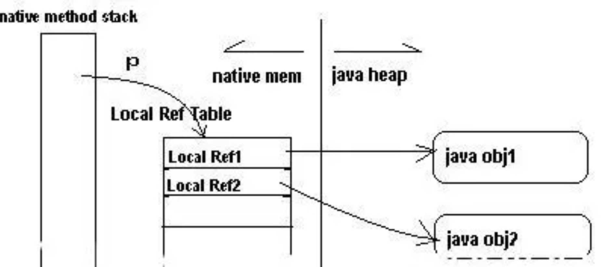

## JNI数据类型 与 JNI API

### JNI数据类型

```java
基本数据类型：	 
jboolean：unsigned char 无符号8为整数 
jbyte：signed char	有符号8位整数 
jchar：unsigned short 无符号16位整数
jshort：signed short 有符号16位整数 
jint：signed int 有符号32位整数 
jlong：signed long 有符号64位整数 
jfloat：float 32位浮点数 
jdouble：double 64位浮点数 

引用数据类型：
jobject：可以代表任何Java对象，或没有JNI对应类型的Java对象（实例方法的强制参数）
jstring：Java的字符串类型
jclass：Java的Class类型（静态方法的强制参数）
jthrowable：Java的Throwable类型
jobjectArray：Java任何对象的数组表示形式
jbyteArray、jbooleanArray、jcharArray、jintArray...
  
数据类型描述符：JVM虚拟机中存储数据类型的名称时是使用描述符来存储（方法签名）
int：I
long：J
byte：B
short：S
char：C
float：F
double：D
boolean：Z
void：V
其他引用类型：L+类全名+;
数组：[
方法：(参数)返回值

例如：
java.lang.String -> Ljava/lang/String;
String[] -> [Ljava/lang/String;
             
long fun(int n, String s, int[] arr); -> (ILjava/lang/String;[I)J
```


### JNI API

```java
JNI有C、C++ 两种代码风格：
C风格：  (*env)->NewStringUTF(env, "Hellow World!");
C++风格：env->NewStringUTF("Hellow World!");
C++风格其实只是封装了C风格，使得调用更加简介方便。

JNI方法大全及使用示例：https://blog.csdn.net/afei__/article/details/81016413
```


## JNI函数的注册方式

### 静态注册

```java
静态注册：按照JNI规范的命名规则进行注册

当在Java中调用native方法时，JVM就会去JNI中寻找 带有JNIEXPORT、JNICALL宏定义的 Java+包名+类名+方法名 函数。
如果没找到会报错，如果找到了就会为这两者建立关联（并且保存JNI的函数指针，这样在下次调用该native方法时就可以直接使用函数指针）

//注册例子：
extern "C" JNIEXPORT jstring JNICALL
Java_com_llk_test_MainActivity_stringFromJNI(JNIEnv* env, jobject obj) {
    std::string hello = "Hello from C++";
    return env->NewStringUTF(hello.c_str());
}
```


### 动态注册

```java
动态注册：通过一个函数映射表注册给JVM，实现动态注册
  
JNI允许我们提供一个函数映射表注册给JVM，这样JVM就可以用函数映射表来调用相应的函数，而不必通过函数名来查找相关函数(这个查找效率很低，函数名超级长)流程更加清晰可控，效率更高
 
//注册例子：
static jstring native_test(JNIEnv *env, jobject thiz) { ... }  

JNIEXPORT jint JNICALL JNI_OnLoad(JavaVM *vm, void *reserved) {
  ...
  jclass cls;
  if (NULL == (cls = (*env)->FindClass(env, "com/llk/test/MainActivity"))) return JNI_ERR;

  JNINativeMethod m[] = {{"stringFromJNI", "()Ljava/lang/String;", (void *)native_test}};
  if (0 != (*env)->RegisterNatives(env, cls, m, sizeof(m) / sizeof(m[0]))) return JNI_ERR;
  ...
}
```


### 静态注册与动态注册的区别

```java
区别就是：首次查找函数指针的效率问题

静态注册缺点：
1. 必须遵循规则 
2. JNI函数名字过长 
3. 首次查找函数效率没有动态注册高
```


## JavaVM 与 JNIEnv

```java
JavaVM：虚拟机在JNI层的代表，一个进程只有一个JavaVM，所有的线程共用一个JavaVM。
  
JNIEnv：Java在native层语言的环境，是一个封装了几乎全部JNI方法的指针。
	JNIEnv只在创建它的线程生效，不能跨线程传递，不同线程的JNIEnv彼此独立。
  native中创建的线程，如果需要访问JNI，必须要调用AttachCurrentThread关联，并使用DetachCurrentThread解除链接。
```


### native线程如何获取JNIEnv

JavaVM是进程唯一的，意味着它是线程共享的。也就是说可以利用它来获取JNIEnv。


### 为什么不能用主线程的JNIEnv

```java
我们获取到主线程的JNIEnv，然后将它做成全局引用（NewGlobalRef），不就可以到处用了吗。
  
这种做法是不可取的，官方文档说明：JavaVM是多执行绪(Multi-threading) 
  
也就说每个JNIEnv都是不同的！特别是在不同线程，都是独自维护各自独立的JNIEnv。
```


### 为什么不能用 GetEnv 获取JNIEnv

```java
javaVM->GetEnv 是获取此线程有效的JNIEnv，只有在java线程里边运行native方案，才能够获取到JNIEnv。
如何是在native中创建的线程，压根就没有JNIEnv。
```


### 使用 AttachCurrentThread 获取JNIEnv

```java
javaVM->AttachCurrentThread 是向虚拟机分配线程独立的JNIEnv，这个JNIEnv只有该线程有效。
执行了javaVM->AttachCurrentThread之后，才能够在该线程使用javaVM->GetEnv获取到有效的JNIEnv。

//获取JNIEnv
JNIEnv *get_env(JavaVM *vm) {
    if (vm == NULL) return NULL;
    JNIEnv *jni_env = NULL;
 
    int status = vm->GetEnv((void **) &jni_env, JNI_VERSION_1_6);
 
    if (status == JNI_EDETACHED || jni_env == NULL) {
        status = vm->AttachCurrentThread(&jni_env, NULL);
        if (status < 0) {
            jni_env = NULL;
        }
    }
    return jni_env;
}
 
//销毁JNIEnv
jint del_env(JavaVM *vm) {
    return vm->DetachCurrentThread();
}
```


### AttachCurrentThread获取的JNIEnv，FindClass找不到类？

```java
原因：JNIEnv的线程独立性
AttachCurrentThread的JNIEnv只加载了系统的类，并不包含自定义的类。所以我们无法在native线程的JNIEnv获取到自定义的类，只能通过主线程的JNIEnv才能获取。
 
解决：
JNIEnv既然不是线程安全，不能直接引用，那我们可以引用其他线程共享的调用对象。
通过主线程的JNIEnv获取到类，然后将它变成全局引用（NewGlobalRef），提供给其他线程使用。
  
//例如：
jobject jMainActivity;

JNIEXPORT void JNICALL
Java_org_zzrblog_MainActivity_nativeThreadEnvTest(JNIEnv *env, jobject thiz) {
    if(jMainActivity == NULL) {
        //调用对象，创建全局引用
        jMainActivity = (*env)->NewGlobalRef(env, thiz);
    }

    pthread_t tid;
    pthread_create(&tid, NULL, pthread_run, (void *) "pthread1"); //pthread_run里边使用jMainActivity
}
```


## JNI_OnLoad 与 JNI_OnUnload

### JNI_OnLoad 

```java
System.loadLibrary加载本地库后，该函数会被调用。

用于保存JavaVM，必须返回本地库所需的JNI版本。
```


### JNI_OnUnload

```java
当GC回收了加载这个库的ClassLoader时，该函数会被调用。
该函数可用于执行清理操作，由于这个函数是在未知的上下文中调用的，所以程序员在使用JavaVM时应该保持谨慎，并且避免任意的Java回调
  
ClassLoader是什么时候被回收的？
当该ClassLoader加载的所有类，这些类的所有实例都失去引用后，ClassLoader以及它所加载的所有类都会被GC
文章：https://blog.csdn.net/m0_37962779/article/details/78279721
```


### 动态库加载与卸载过程

```java
加载过程：
System.loadLibrary(libName)
-> Runtime.loadLibrary0(libNane)
    -> ClassLoader#findLibrary(libName)-> DexPathList#findLibrary(libName)  
    -> nativeLoad(libPath)

1、搜索so文件路径（逻辑在：DexPathList#findLibrary）
  如果调用 System.load 方法，传入的是so文件绝对路径，并不会进行搜索。
  1.1、拼接 lib + so名称 + .so
  1.2、遍历nativeLibraryPathElements路径，查找so文件
       nativeLibraryPathElements路径包括：优先查找app目录，然后再到系统目录
  	   app目录下的so库路径（/data/app/[packagename]/lib/arm64）
       系统so库存储路径（/system/lib64、/vendor/lib64）
   1.3、搜索目标so文件，如果存在返回拼接后的绝对路径，如果不存在则抛异常。
2、加载so文件（逻辑在：Runtime#nativeLoad -> Runtime.c#Runtime_nativeLoad -> java_vm_ext.cc#JavaVMExt::LoadNativeLibrary）
  2.1、检查是否已经加载过，如果已加载则跳过（根据绝对路径从libraries_容器中so的对象，获取到则说明已加载）
  2.2、调用 dlopen 加载so
  2.3、创建共享库对象（new SharedLibrary(... class_loader ...)）
       共享库对象中持有 ClassLoader（卸载so时用到）
  2.4、将共享库对象SharedLibrary，缓存到 libraries_ 容器中
  2.5、调用so中的 JNI_OnLoad 函数
  
卸载过程：
JDK并没有提供直接卸载so库的方法，而是在ClassLoader卸载时跟随卸载。
heap.cc#Heap::CollectGarbageInternal -> java_vm_ext.cc#UnloadNativeLibraries
 
1、遍历 libraries_ 容器，检查对象中 ClassLoader 是否已经被卸载（unload）
   如果ClassLoader已经被卸载，将SharedLibrary加入到 unload_libraries 容器
2、遍历 unload_libraries 容器，执行
  //dlsym系统调用：从动态库获取该函数的符号地址
  //第一个参数动态句柄，dlopen返回的
  //第二个参数函数名
  void* const sym = dlsym(library, "JNI_OnUnload")
  //强转成JNI_OnUnload函数指针
  JNI_OnUnloadFn jni_on_unload = reinterpret_cast<JNI_OnUnloadFn>(sym);
  //执行JNI_OnUnload函数
  jni_on_unload(self->GetJniEnv()->GetVm(), nullptr);
3、释放该SharedLibrary对象，在析构函数的时候会走 dlclose 关闭so库。
```


#### System.loadLibrary加载的动态库，可以用dlclose关闭吗

```java
JDK并没有提供直接卸载so库的方法，而是在ClassLoader卸载时跟随卸载。

通过System.loadLibrary加载的动态库，虽然是通过dlopen加载的，但是连带的还会产生一个SharedLibrary对象，并且会加入到一个容器中缓存起来。
  
如果我们通过dlclose去关闭该动态库，那么虚拟机里边的SharedLibrary对象缓存就不会被清除。这样会导致再用System.loadLibrary加载的时候直接就返回了，不走dlopen了。
```


#### Android so的热升级尝试

```java
Android so的热升级尝试：https://cloud.tencent.com/developer/article/1006541
在这文章中讲到了，可以自己动态使用dlopen来加载so，然后再手动调用JNI_OnLoad。不过每次dlopen后so句柄会发生变化，需要重新通过RegisterNatives动态注册JNi函数。
```


## JNI中的引用

```java
虚拟机创建的对象传到JNI层就会产生引用 或者 在JNI层用过API创建的Java对象也会产生引用。
根据垃圾回收机制，只要有引用存在就不会触发该引用指向的Java对象的垃圾回收。
  
这些引用在JNI层有三种类型：
局部引用 （Local Reference）
全局引用 （Global Reference）
弱全局引用 （Weak Global Reference）
```


### 局部引用

```java
局部引用由JNI创建（JNI函数传进来的Java对象），也可以手动创建（ API：NewLocalRef(jobject obj) ）。
局部引用只有在当前的native函数调用链中有效，所有在该函数中产生的局部引用，都会在函数返回的时候自动释放。
在局部引用期间能阻止对象被垃圾回收。

注意点：
1、局部引用是会自动释放的
局部引用只在该native函数调用链中有效，所有在该函数中产生的局部引用，都会在函数返回的时候自动释放。
（也可以使用DeleteLocalRef函数进行手动释放该引用）
  创建函数：jobject NewLocalRef(jobject obj)
  释放函数：void DeleteLocalRef(jobject obj)
  
//例子：
Java_com_xxx_init(JNIEnv *env, jclass clazz, jobject context) { //context是局部引用
    jstring str = env->NewStringUTF("love"); //str局部引用
    return str; //str在返回后自动释放
}

2、千万别用C++静态变量缓存局部引用
//例子：
Java_com_xxx_init(...) {
   static jclass jStringClass; //静态变量
   if (jStringClass == NULL) {
       jStringClass = (*env)->FindClass(env, STRING_PATH);
   }

   jmethodID jinit = (*env)->GetMethodID(env, jStringClass, "<init>", "([B)V");

   int len = strlen(STRING_PATH);
   jcharArray jchars = (*env)->NewByteArray(env, len); 
   (*env)->SetByteArrayRegion(env, jchars, 0, len, STRING_PATH);

   return (*env)->NewObject(env, jStringClass, jinit, jchars); //局部引用在函数返回后会被释放
}
//分析：
第一次调用时jStringClass为NULL，不会有问题，对jStringClass进行初始化，然后使用它。
但是第二次调用时静态的jStringClass就不是NULL了，但是它所引用的对象在第一次调用结束后就已经被释放了，因此再进行使用时，则会触发错误，导致应用crash了。
```


#### 局部引用会自己释放，那为什么还需要DeleteLocalRef函数

```java
实际上局部引用存在，就会防止其指向的对象被垃圾回收。

1、防止内存浪费：
当一个局部引用指向一个很庞大的对象，或是在一个循环中生成了局部应用；最好的做法就是在使用完该对象后，或在该循环尾部把这个引用释放掉，以确保在垃圾回收器被触发的时候被回收。

//例子：
/* A native method implementation */
JNIEXPORT void JNICALL
Java_pkg_Cls_func(JNIEnv *env, jobject this){
	lref = ... /* 引用一个占大内存的Java对象 */
	... /* 最后使用引用lref */
	(*env)->DeleteLocalRef(env, lref); // 释放局部引用
	lengthyComputation(); /* 其他一些耗时的操作 */
	return; /* all local refs are freed */
}

2、防止局部引用表溢出：
JNI会将创建的局部引用都存储在一个局部引用表中，该局部引用表的最大数量是512。当一个本地方法中，创建了大量的局部引用，会导致局部引用表溢出。
//例子：
Java_com_xxx_stringFromJNI(...) {
    jint i = 0;
    std::string hello = "Hello from C++";
    for (i = 0; i < 1000000; i++)
        //很快就会炸
        //抛出：JNI ERROR (app bug): local reference table overflow (max=512)
        jstring str = env->NewStringUTF(hello.c_str()); 

    return NULL;
}

每当线程从Java环境切换到本地代码上下文时（J2N），JVM会分配一块内存，创建一个局部引用表，这个表用来存放本次本地方法执行中创建的所有的局部引用。每当在本地代码中引用到一个Java对象时，JVM就会在这个表中创建一个 局部引用。比如，实例一中我们调用NewStringUTF()在Java堆中创建一个String对象后，在局部引用表中就会相应新增一个局部引用。

依赖关系：局部变量 -> 局部引用表中局部引用 -> Java对象
当native函数返回，局部引用表中局部引用就会与Java对象断开联系
```




#### 防止局部引用表溢出问题

```java
为了防止局部引用表溢出问题：JDK提供了一套新的方法来管理局部引用的生命周期的API，包括EnsureLocalCapacity、PushLocalFrame/PopLocalFrame

JNI规范指出，任何实现JNI规范的JVM，必须确保每个native函数至少可以创建16个局部引用（可以理解为虚拟机默认支持创建16个局部引用）。实际经验表明，这个数量已经满足大多数不需要和JVM中内部对象有太多交互的本地方函数。

EnsureLocalCapacity函数：扩充指定容量的局部引用数量
如果需要创建更多的引用，可以通过EnsureLocalCapacity函数，确保在当前线程中创建指定数量的局部引用，如果创建成功则返回0，否则创建失败并抛出OutOfMemoryError异常。
  
//例子：
if (env->EnsureLocalCapacity(len)) < 0) {  //确保是否有len个局部引用的空间
    ... /* out of memory */
}
...

  
PushLocalFrame/PopLocalFrame函数：允许创建一个局部引用的嵌套作用域  
它们可以为局部引用创建一个指定数量内嵌的空间，在这个函数对之间的局部引用都会在这个空间内，直到释放后，所有的局部引用都会被释放掉，不用再担心每一个局部引用的释放问题了。
  
在有循环或大量创建局部引用的地方，可以使用Push/PopLocalFrame来管理这些局部引用，不必为创建的引用没有释放而担心
  
//例子：
    for (int i = 0; i < len; ++i) {
        if (env->PushLocalFrame(len)) { // 创建指定数据的局部引用空间
            //out ot memory
        }
        jstring jstr = env->GetObjectArrayElement(arr, i);
        // 处理字符串
        // 期间创建的局部引用，都会在 PushLocalFrame 创建的局部引用空间中
        // 调用 PopLocalFrame 直接释放这个空间内的所有局部引用
        env->PopLocalFrame(NULL); 
    }
```


### 全局引用

```java
全局引用可以跨越当前线程，在多个native函数中有效。
全局引用存在期间会防止在Java的垃圾回收的回收。

注意点：
需要手动创建与释放
  创建函数：jobject NewGlabalRef(jobject obj)
  释放函数：void DeleteGlobalRef(jobject obj)
  
//例子：
jclass cls_string = env->FindClass("java/lang/String");
g_cls_string = env->NewGlobalRef(cls_string);
```


### 弱全局引用

```java
弱全局引用与全局引用一样可以在多个native函数中有效，也可以跨越多线程。
不一样的是，这种引用将不会阻止垃圾回收器回收这个引用所指向的对象。

注意点：
1、需要手动创建与释放
	创建函数：jobject NewWeakGlobalRef(jobject obj)
  释放函数：void DeleteWeakGlobalRef(jobject obj)
  
2、使用前需要判断对象是否被回收
  API：jboolean IsSameObject(jobject obj1, jobject obj2)
  把NULL传入要比较的对象中，就能够判断弱全局引用所指向的Java对象是否被回收。
  
  //例子: 
  jclass cls_string = env->FindClass("java/lang/String");
  g_cls_string = env->NewWeakGlobalRef(cls_string);
  if(!env->IsSameObject(g_cls_string, NULL)){ //没被回收
    ...
  }
```


### JNI引用原理

```java
在 JavaVM 和 JNIEnv 中，会分别建立多个表管理引用：

JavaVM 内有 globals 和 weak_globals 两个表管理全局引用和弱全局引用。由于 JavaVM 是进程共享的，因此全局引用可以跨方法和跨线程共享；
  
JavaEnv 内有 locals 表管理局部引用，由于 JavaEnv 是线程独占的，因此局部引用不能跨线程。另外虚拟机在进入和退出本地方法通过 Cookie 信息记录哪些局部引用是在哪些本地方法中创建的，因此局部引用是不能跨方法的。
  
JNI 函数 IsSameObject 判断两个引用是否指向相同对象（适用于三种引用类型），返回值为 JNI_TRUE 时表示相同，返回值为 JNI_FALSE 表示不同
```


### 缓存jfieldID / jmethodID

```java
获取 jfieldID 与 jmethodID 的时候会通过该属性/方法名称加上签名来查询相应的 jfieldID/jmethodID。这种查询相对来说开销较大。
在开发中可以将这些 FieldID/MethodID 缓存起来，这样就只需要查询一次，以后就使用缓存起来的 FieldID/MethodID。

下面介绍两种缓存方式：
1、在使用时缓存
使用static局部变量来保存已经查询过的jfieldID/jmethodID ，这样就不会在每次的函数调用时查询，而只要一次查询成功后就保存起来了。
不过这种情况下，就不得不考虑多线程同时调用此函数时可能导致同时查询的并发问题，不过这种情况是无害的，因为查询同一个属性或者方法的ID，通常返回的值是一样的。
  
//例子：
JNIEXPORT void JNICALL Java_Test_native( JNIEnv* env, jobject ojb) {
  static jfieldID fieldID_str = NULL;
  jclass clazz = env->GetObjectClass( obj );
  if(fieldID_str == NULL){
  fieldID_str = env->GetFieldID(clazz, "strField", "Ljava/lang/String");
}

2、在Java类初始化时缓存
更好的一个方式就是在任何native函数调用之前把id全部缓存起来。
可以让Java在第一次加载这个类的时候，首先调用本地代码初始化所有的 jfieldID/jmethodID，这样的话就可以省去多次判断id是否存在的冗余代码。当然，这些 jfieldID/jmethodID 是定义在C/C++ 的全局。
使用这种方式还有好处，当Java类卸载或者重新加载的时候，也会重新调用该本地代码来重新计算IDs。
  
//例如：
//java code
public class TestNative {
  static {
    initNativeIDs();
  }
  
	static native void initNativeIDs();
  
  ...
}
  
//native code
jfieldID g_propInt_id = 0;
jfieldID g_propStr_id = 0;
JNIEXPORT void JNICALL Java_TestNative_initNativeIDs( JNIEnv* env, jobject clazz){
  g_propInt_id = env->GetFieldID(clazz, "propInt", "I");
  g_propStr_id = env->GetFieldID(clazz, "propStr", "Ljava/lang/String;");
}
```


## JNI函数线程同步问题

如果java中存在多个线程调用native方法，那么jni层也会存在线程安全问题。

因为jni函数执行与java调用的线程保持一致，即处于同一个线程中。

```java
//案例：native层线程不安全案例
//native层代码：
int i = 0;
Java_com_xxx_MainActivity_add(...) {
    ++i;
}
Java_com_xxx_MainActivity_get(...) {
    return i;
}

//java层：
java启动四个线程，调用native add方法共40000次，最后用native get获取值进行打印。

//结果：i的值为39670
```


### 解决线程同步问题

```java
1、java层加锁
   synchronized (mLock) {
   		add(); //native方法
   }

2、native层加锁：mutex（与java的Lock类似）
  //例子：
  #include <thread>
  std::mutex g_mutex;
  Java_com_xxx_MainActivity_add(...) {
      g_mutex.lock();
      ++i;
      g_mutex.unlock();
  }
  
3、java层与native层公用一把锁
  可以将java层的锁对象传给native层，这样就实现java与native加同一把锁。

  //例子：
	Java_com_xxx_MainActivity_add(..., jobject lock) {
      env->MonitorEnter(lock);
      ++i;
      env->MonitorExit(lock);
   }
```


### JNI的线程同步API

```java
//JNI API
jint        (*MonitorEnter)(JNIEnv*, jobject); //进入同步块
jint        (*MonitorExit)(JNIEnv*, jobject); //退出同步课

//不过JNI并没有提供同步相关的API，需要自己反调用JAVA方法实现。
void JNU_MonitorWait(JNIEnv *env, jobject object, jlong timeout) {
    env->CallVoidMethod(object, MID_Object_wait, timeout);
}
void JNU_MonitorNotify(JNIEnv *env, jobject object) {
    env->CallVoidMethod(object, MID_Object_notify);
}
void JNU_MonitorNotifyAll(JNIEnv *env, jobject object) {
    env->CallVoidMethod(object, MID_Object_notifyAll);
}
```


## JNI异常处理机制

JNI 中的异常机制与 Java 和 C/C++ 的处理机制都不同：

- **Java 和 C/C++**： 程序使用关键字 `throw` 抛出异常，虚拟机会中断当前执行流程，转而去寻找匹配的 catch{} 块，或者继续向外层抛出寻找匹配 catch {} 块。
- **JNI**： 程序使用 JNI 函数 `ThrowNew` 抛出异常，程序不会中断当前执行流程，而是返回 Java 层后，虚拟机才会抛出这个异常。

因此，在 JNI 层出现异常时，有 2 种处理选择：

- **方法 1**：直接 `return` 当前方法，让 Java 层去处理这个异常（这类似于在 Java 中向方法外层抛出异常）；
- **方法 2**：通过 JNI 函数 `ExceptionClear` 清除这个异常，再执行异常处理程序（这类似于在 Java 中 try-catch 处理异常）。需要注意的是，当异常发生时，必须先处理-清除异常，再执行其他 JNI 函数调用。 **因为当运行环境存在未处理的异常时，只能调用 2 种 JNI 函数：异常护理函数和清理资源函数。**

JNI 提供了以下与异常处理相关的 JNI 函数：

- **ThrowNew** ：向 Java 层抛出异常；
- **ExceptionDescribe** ：打印异常描述信息；
- **ExceptionOccurred**： 检查当前环境是否发生异常，如果存在异常则返回该异常对象；
- **ExceptionCheck** ：检查当前环境是否发生异常，如果存在异常则返回 JNI_TRUE，否则返回 JNI_FALSE；
- **ExceptionClear**：清除当前环境的异常。

```java
// 示例 1：向 Java 层抛出异常
jclass exceptionClz = env->FindClass("java/lang/IllegalArgumentException");
env->ThrowNew(exceptionClz, "来自 Native 的异常");

// 示例 2：检查当前环境是否发生异常（类似于 Java try{}）
jthrowable exc = env->ExceptionOccurred(env);
if(exc) {
    //处理异常（类似于 Java 的 catch{}）
}

// 示例 3：清除异常
env->ExceptionClear();


异常处理的步骤我懂了，由于虚拟机在遇到 ThrowNew 时不会中断当前执行流程，那我怎么知道当前已经发生异常呢？
有2种方法：
方法1：通过函数返回值错误码，大部分 JNI 函数和库函数都会有特定的返回值来标示错误，例如 -1、NULL 等。在程序流程中可以多检查函数返回值来判断异常。
方法2：通过 JNI 函数 ExceptionOccurred 或 ExceptionCheck 检查当前是否有异常发生。
```

