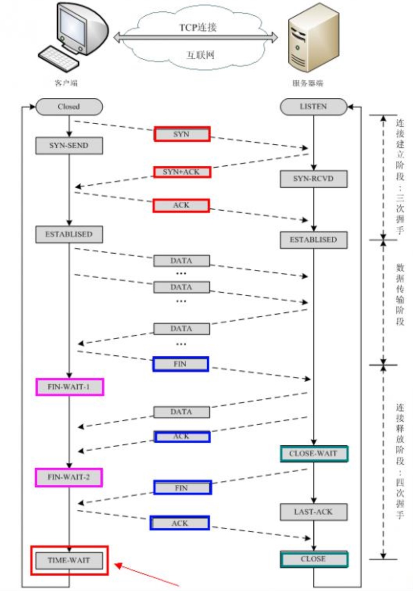

## Http

### http1.1 keep-alive 与 websocket区别？

```java
总结：keep-alive是单向的，websocket是双向的。

Keep-alive实现的长连接，本质上依然是客户端主动发起-服务端应答的模式，是没法做到服务端主动发送通知给客户端的。
也就是说，在一个HTTP连接中，可以发送多个Request，接收多个Response。但是一个request只能有一个response。而且这个response也是被动的，不能主动发起。

WebSocket是类似TCP长连接的通讯模式，一旦WebSocket连接建立后，后续数据都以帧序列的形式传输。在客户端断开WebSocket连接或Server端断掉连接前，不需要客户端和服务端重新发起连接请求。
```


### http1.0 特点与缺点

```java
特点：
0、引入了header概念，其中比较核心的字段就是Content-Type字段，来告诉浏览器返回文件的类型。
1、无连接（每次请求都必须新建一次TCP连接）
2、无状态
HTTP协议无法根据之前的状态进行本次的请求处理。不保存状态是有它的优点的，可以减少服务器的CPU及内存资源的消耗。
但问题也是显而易见，假设系统需要登录后才能访问，由于无状态的特点，每次跳转页面都需要重新登录，这是难以想象的。

为了解决无状态的问题，引入Cookie技术。
Cookie技术通过在请求和响应报文中写入Cookie信息来控制客户端的状态。
首次访问服务端时，响应报文内会返回一个叫Set-Cookie的首部字段信息，通知客户端保存Cookie。当下次客户端再往该服务器发送请求时，客户端会自动在请求报文中加入 Cookie 值后发送出去。
服务端发现客户端发送过来的 Cookie 后，会去检查究竟是从哪个客户端发送来的请求，然后对比服务器上的记录，最后得到之前的状态信息。


缺点：
1、连接无法复用（每次请求都需要建立一个TCP连接）
2、队头阻塞。下一个请求必须在前一个请求响应到达后发送。如果某请求一直不到达，那么下一个请求就一直不发送。（高延迟，带来页面加载速度的降低）
	例如：客户端需要发送A，B两个请求，先发请求A，需要收到请求A的响应后，才会发送请求B。
```


### http1.1 特点与缺点

```java
特点：
1、长连接：通过Keep-Alive保持HTTP连接不断开，避免重复建立TCP连接
2、并发连接：对一个域名的请求允许分配多个长连接（缓解了长连接中的「队头阻塞」问题）
3、管道机制（pipeline）：一个TCP连接内，多个HTTP请求可以并行，客户端不用等待上一次请求结果返回，就可以发出下一次请求。
	但服务器端必须按照接收到客户端请求的先后顺序依次回送响应结果，以保证客户端能够区分出每次请求的响应内容。
4、新增了一些缓存的字段（If-Modified-Since, If-None-Match）

5、请求头中引入了 range 字段，支持断点续传
	例如：客户端下载一个文件，已经下载了一部分了，就不需要从0开始下了，从某个位置开始下载就好了。
	客户端可以在请求头增加：RANGE: bytes=2000070- （告诉服务端从 2000070 字节开始返回）
	服务器收到请求后，会返回响应码206，并且响应头多了 Content-Range=bytes 2000070-106786027/106786028 

6、允许响应数据分块（chunked），利于传输大文件（chunked与Content-Length是互斥的，两者只会出现一个）
   当响应头出现Transfer-Encoding: chunked，就是分块传输，并且输出的内容长度不能确定。
   1、每个分块（响应数据体）包含分块长度和数据块两个部分；
	2、分块长度使用 16 进制数字表示，以\r\n结尾；
	3、数据块紧跟在分块长度后面，也使用\r\n结尾，但数据不包含\r\n；
	4、终止块是一个常规的分块，表示块的结束。不同之处在于其长度为0，即0\r\n\r\n。


缺点：
1、keep-alive会给服务器带来性能压力，并且自身会出现并发能力会受到限制的问题。
   1.1 keep-alive可以复用一部分连接，但域名分片等情况下仍然需要建立多个connection，耗费资源，给服务器带来性能压力。
   
   1.2 keep-alive虽然减少了大量创建/断开连接造成的性能消耗，但是它的并发能力会受到限制。
   浏览器为了减轻服务器的压力，限制了同一个域名下的HTTP连接数，一般为6~8个。

   什么是域名分片技术？
   为了解决数量限制，出现了域名分片技术。其实就是资源分域，将资源放在不同域名下 (比如二级子域名下)，这样就可以针对不同域名创建连接并请求，以一种讨巧的方式突破限制，但是滥用此技术也会造成很多问题，比如每个 TCP 连接本身需要经过 DNS 查询、三步握手、慢启动等，还占用额外的 CPU 和内存，对于服务器来说过多连接也容易造成网络拥挤、交通阻塞等。

2、管道机制（pipeline）只部分解决队头阻塞问题。 即浏览器可以一次性发出多个请求（同个域名、同一条TC 链接）。 
   但pipeline要求返回是按序的，如果前一个请求如果很耗时，那么后面的请求即使服务器已经处理完，仍会等待前面的请求处理完才开始按序返回。

3、协议开销大，没有相应的压缩传输优化方案。
   http1.1 header里携带的内容过大，在一定程度上增加了传输的成本，并且每次请求header基本不怎么变化，会造成流量浪费。
```


### http2.0 特点与缺点

```java
特点：
1、二进制协议：头部和数据部分都是二进制。不再使用ASCII编码传输，而是改为二进制数据，来提升传输效率。
	http1.1版本的头部是文本，数据可以是文本也可以是二进制。http2默认全部是二进制。
2、多路复用：同一个TCP连接里客户端和服务器可以同时发送多个请求和多个响应，并且不用按照顺序来。由于服务器不用按顺序来处理响应，所以避免「队头阻塞」问题。
	http1.1的管道机制被废弃，因为http1.1只能解决部分「队头阻塞」问题，并不能根治。
3、头部信息压缩：通过hpack协议，减少数据传输量。
   http1头是使用key-value方式表示每个头字段的，然而http请求的许多头字段都是高度相似的，每次都传递这些字段会造成资源浪费。
	hpack协议：客户端与服务端各自都维护两个相同的表，一个静态表一个动态表。
	静态表：记录一些常见的头字段
	例如：
	1 method: GET
	2 method: POST
	传输的时候，只需要传 1 就可以知道是 :method: GET

	动态表：可以动态添加内容
	例如：
	63 cookie: xxxxxxx

4、服务端主动推送：允许服务器主动向客户推送数据
	允许服务器预测客户端的需要，在请求处理完成之前就可以先发一个 PUSH_PROMISE frame，然后在 push 资源。为防止发送不必要的资源，服务器会给每一个要推送的资源发送一个 PUSH_PROMISE frame，如果资源已经有缓存，浏览器可以 respond 一个 RST_STREAM frame，来拒绝 PUSH

5、数据流：数据包不是按照顺序发送的，同一个TCP连接里面相连的两个数据包可能是属于不同的响应，因此，必须要有一种方法来区分每一个数据包属于哪个响应。
	http2中，每个请求或者响应的所有数据包，称为一个数据流（stream），并且每一个数据流都有一个唯一的编号ID，请求数据流的编号ID为奇数，响应数据流的编号ID为偶数。每个数据包在发送的时候带上对应数据流的编号ID，这样服务器和客户端就能分区是属于哪一个数据流。最后，客户端还能指定数据流的优先级，优先级越高，服务器会越快做出响应。

缺点：
在TCP协议级别上仍然存在类似的队头问题，而TCP仍然是Web的构建基础。当 TCP 数据包在传输过程中丢失时，在服务器重新发送丢失的数据包之前，接收方无法确认传入的数据包。由于 TCP 在设计上不遵循 HTTP 之类的高级协议，因此单个丢失的数据包将阻塞所有进行中的 HTTP 请求的流，直到重新发送丢失的数据为止。这个问题在不可靠的连接上尤为突出，这在无处不在的移动设备时代并不罕见。
```


### http3.0

```java
http3.0 - 要思想是放弃TCP，转而使用基于UDP的QUIC（快速UDP互联网连接）协议。
与 HTTP2 在技术上允许未加密的通信不同，QUIC 严格要求加密后才能建立连接。此外，加密不仅适用于 HTTP 负载，还适用于流经连接的所有数据，从而避免了一大堆安全问题。建立持久连接、协商加密协议，甚至发送第一批数据都被合并到 QUIC 中的单个请求/响应周期中，从而大大减少了连接等待时间。如果客户端具有本地缓存的密码参数，则可以通过简化的握手重新建立与已知主机的连接。

为了解决传输级别的线头阻塞问题，通过 QUIC 连接传输的数据被分为一些流。流是持久性 QUIC 连接中短暂、独立的“子连接”。每个流都处理自己的错误纠正和传递保证，但使用连接全局压缩和加密属性。每个客户端发起的 HTTP 请求都在单独的流上运行，因此丢失数据包不会影响其他流/请求的数据传输。
```


### Http与Https的区别

```java
Http存在着这些缺点：
通信使用明文，内容可能被窃听(重要密码泄露)
不验证通信方身份，有可能遭遇伪装(跨站点请求伪造)
无法证明报文的完整性，有可能已遭篡改(运营商劫持)

Https是在http协议基础上加入 加密处理、认证机制、完整性保护。（http+加密+认证+完整性保护=https）
```


### Http 怎么支持断点续传的？

```java
Http1.1协议中默认支持获取文件的部分内容，这其中主要是通过头部的两个参数：Range 和 Content Range 来实现的。客户端发请求时对应的是 Range ，服务器端响应时对应的是 Content-Range。
  
Range：
客户端想要获取文件的部分内容，那么它就需要请求头部中的 Range 参数中指定获取内容的起始字节的位置和终止字节的位置，它的格式一般为：
Range:(unit=first byte pos)-[last byte pos]
例如：
Range: bytes=0-499      表示第 0-499 字节范围的内容 
Range: bytes=500-999    表示第 500-999 字节范围的内容 
Range: bytes=-500       表示最后 500 字节的内容 
Range: bytes=500-       表示从第 500 字节开始到文件结束部分的内容 
Range: bytes=0-0,-1     表示第一个和最后一个字节 
Range: bytes=500-600,601-999 同时指定几个范围

Content Range：
在收到客户端中携带 Range 的请求后，服务器会在响应的头部中添加 Content Range 参数，返回可接受的文件字节范围及其文件的总大小。它的格式如下：
Content-Range: bytes (unit first byte pos) - [last byte pos]/[entity legth]
例如：
Content-Range: bytes 0-499/22400    // 0－499 是指当前发送的数据的范围，而 22400 则是文件的总大小。
  
使用断点续传和不使用断点续传的响应内容区别：
不使用断点续传：HTTP/1.1 200 Ok
使用断点续传：HTTP/1.1 206 Partial Content
  
处理请求资源发生改变的问题：
在现实的场景中，服务器中的文件是会有发生变化的情况的，那么我们发起续传的请求肯定是失败的，那么为了处理这种服务器文件资源发生改变的问题，在 RFC2616 中定义了 Last-Modified 和 Etag 来判断续传文件资源是否发生改变。
  Last-Modified & If-Modified-Since（文件最后修改时间）
  Last-Modified：记录 Http 页面最后修改时间的 Http 头部参数，Last-Modified 是由服务端发送给客户端的
  If-Modified-Since：记录 Http 页面最后修改时间的 Http 头部参数，If-Modified-Since 是有客户端发送给客户端的
```


## Https

### https是如何加密的？+5

```java
对称加密：双方用同一个密钥进行加密解密。（效率高，但是涉及密钥传递）
非对称加密：公钥加密，私钥解密。公钥可以公开，私钥要保密。（不涉及密钥传递，但是效率不高）
数字证书认证：防止公钥被篡改，需要第三方机构来担保你的公钥的正确性。
	你需要把公钥给CA机构认证（CA机构会用它的公钥签名你的公钥），然后将认证的公钥返回给你，你就可以发布你的公钥了。
  浏览器或系统会内置CA机构的公钥，对你的公钥进行认证真伪，是真的就提取你的公钥。


TLS（SSL3.1就是TLS）是更为安全的升级版 SSL，ssl在应用层跟传输层之间）
tcp完成连接之后
客户端发送client hello （random_c + 一堆密码套件（假设x,y,z））
服务端发送server hello （random_s + 选了其中某个密码套件(假设选了x)）
服务端又发Server Key Exchange （服务端下发CA认证公钥）
服务端最后发送hello done

客户端验证发过来的服务端公钥
客户端根据 (random_c + random_s)x 生成 pre-master
客户端发送 (pre-master)(服务端公钥加密)

服务端收到(pre-master)(服务端公钥加密)后，用私钥解密得到 pre-master
服务端根据 (random_c + random_s)x 生成my_pre-master，pre-master 与 my_pre-master比对。

服务端发送 用pre-master加密的“Finished”消息。（服务端：我要确认客户端的密钥是不是对的）
客户端发送 也用pre-master加密的“Finished”消息。（客户端：我解出来了，服务端的密钥是对的。我要把这消息告诉服务端一声）
完成tls握手
```


## TCP

### TCP11种状态



```java
CLOSED状态：初始状态，表示TCP连接是“关闭的”或者“未打开的”

LISTEN状态：表示服务端的某个端口正处于监听状态，正在等待客户端连接的到来

SYN_SENT状态：当客户端发送SYN请求建立连接之后，客户端处于SYN_SENT状态，等待服务器发送SYN+ACK

SYN_RCVD状态：当服务器收到来自客户端的连接请求SYN之后，服务器处于SYN_RCVD状态，在接收到SYN请求之后会向客户端回复一个SYN+ACK的确认报文

ESTABLISED状态：当客户端回复服务器一个ACK和服务器收到该ACK（TCP最后一次握手）之后，服务器和客户端都处于该状态，表示TCP连接已经成功建立

FIN_WAIT_1状态：当数据传输期间当客户端想断开连接，向服务器发送了一个FIN之后，客户端处于该状态

FIN_WAIT_2状态：当客户端收到服务器发送的连接断开确认ACK之后，客户端处于该状态

CLOSE_WAIT状态：当服务器发送连接断开确认ACK之后但是还没有发送自己的FIN之前的这段时间，服务器处于该状态

TIME_WAIT状态：当客户端收到了服务器发送的FIN并且发送了自己的ACK之后，客户端处于该状态

LAST_ACK状态：表示被动关闭的一方（比如服务器）在发送FIN之后，等待对方的ACK报文时，就处于该状态

CLOSING状态：连接断开期间，一般是客户端发送一个FIN，然后服务器回复一个ACK，然后服务器发送完数据后再回复一个FIN，当客户端和服务器同时接受到FIN时，客户端和服务器处于CLOSING状态，也就是此时双方都正在关闭同一个连接
```


### TCP建立连接需要三次握手？

```java
目的：确保双方的收发能力

1、客户端 向 服务端 发送连接请求报文，SYN=1，ACK=0，选择一个初始的序号x。
2、服务端 收到连接请求报文，如果同意建立连接，则向 客户端 发送连接确认报文，SYN=1，ACK=1，确认号为 x+1，同时也选择一个初始的序号 y。
3、客户端 收到 服务端 的连接确认报文后，还要向 服务端 发出确认，确认号为 y+1，序号为 x+1。
服务端 收到 客户端 的确认后，连接建立。

客户端发，服务端收。-> 服务端结论：客户端发送功能正常、自己接收功能正常。
服务端发，客户端收。-> 客户端结论：自己发送功能正常、接收功能正常，服务端发送功能正常、接收功能正常。
客户端发，服务端收。-> 服务端结论：自己发送功能正常。
```


### TCP关闭连接为什么是四次挥手？

```java
目的：确保双方都断开连接

每个方向都需要一个 FIN 和一个 ACK，因此通常被称为四次挥手
1、客户端打算关闭连接，此时会发送 FIN 报文，之后客户端进入 FIN_WAIT_1 状态。
2、服务端收到该报文后，就向客户端发送 ACK 应答报文，接着服务端进入 CLOSED_WAIT 状态。
客户端收到服务端的 ACK 应答报文后，之后进入 FIN_WAIT_2 状态。
3、等待服务端处理完数据后，也向客户端发送 FIN 报文，之后服务端进入 LAST_ACK 状态。
4、客户端收到服务端的 FIN 报文后，回一个 ACK 应答报文，之后进入 TIME_WAIT 状态。
服务器收到了 ACK 应答报文后，就进入了 CLOSE 状态，至此服务端已经完成连接的关闭。
客户端在经过 2MSL 时间后，自动进入 CLOSE 状态，至此客户端也完成连接的关闭。

客户端发，服务端收。-> 服务端知道客户端的关闭请求了。
服务端发，客户端收。-> 客户端知道发送的请求已经送达了。
但是服务端可能还有数据没发送完成，还不同意关闭。
服务端发，客户端收。-> 服务端处理完了，同意关闭了。
客户端发，服务端收。-> 通知服务端一声，自己收到服务端的同意指令了。
最后服务端关闭连接，客户端还会等待一段时间再执行关闭。
```


### TCP在四次挥手之后为什么还要一个TIME_WAIT（等待2MSL的时间）？

```java
MSL是 Maximum Segment Lifetime，报文最大生存时间。（Linux里一个MSL是30秒。Linux系统停留在TIME_WAIT的时间为固定的60秒）

① 保证连接正确关闭。
TIME-WAIT作用是等待足够的时间以确保最后的ACK报文能让服务端接收到，从而帮助其正常关闭。
如果服务端等待一段时候没收到ACK，就会再发送一个FIN给客户端。

② 防止旧连接的数据包。
服务端有可能在关闭之前，给客户端发送数据。但是由于网络延迟，延时到达了。
这时有相同端口的tcp连接被复用后，被延迟的数据抵达了客户端，那么客户端是有可能接收这个过期数据的，这就会产生数据错乱等严重的问题。

  
过多的TIME_WAIT会照成什么影响？怎么优化？
① 内存资源占用；
② 对端口资源的占用，一个tcp连接消耗一个本地端口（端口资源是有限的）。

优化：
1、打开 net.ipv4.tcp_tw_reuse 和 net.ipv4.tcp_timestamps 选项；（复用处于 TIME_WAIT 的 socket 为新的连接所用。）
2、net.ipv4.tcp_max_tw_buckets（一旦超过这个值时，系统就会将所有的 TIME_WAIT 连接状态重置。好危险的！）
3、程序中使用 SO_LINGER ，应用强制使用 RST 关闭。（设置 socket 选项，来设置调用 close 关闭连接行为。如果l_onoff为非 0， 且l_linger值为 0，那么调用close后，会立该发送一个RST标志给对端，该 TCP 连接将跳过四次挥手，也就跳过了TIME_WAIT状态，直接关闭。）
```


### TCP连接以后突然故障了怎么办（心跳机制）？

```java
TCP有一个心跳机制。
定义一个时间段，在这个时间段内，如果没有任何连接相关的活动，TCP保活机制会开始作用，每隔一段时间发送一个心跳报文，如果连续几个心跳报文都没有得到响应，则认为当前的tcp连接已经死亡，系统内核将错误信息通知给上层应用程序。
```


### TCP为什么会出现粘包、拆包？怎么解决？

```java
拆包的产生：
1、要发送的数据大于MSS，TCP会在传输前帮你拆包
2、要发送的数据大于TCP发送缓冲区剩余空间大小，会发生拆包
  
粘包的产生：
1、要发送的数据小于TCP发送缓冲区的大小，那么该数据包将要与其他数据包挤在同一个发送缓冲区，产生粘包。
  例如：我要发两个小数据包，正常情况下服务端应该收到两数据包。
       但是TCP见你这两个数据包太小了，还不够填满它的一个缓冲区，于是乎就两个数据包放到了一个缓冲区，再发出。
  	   结果导致了服务端只收到一个数据包，不知道怎么解析了。
2、接收数据端的应用层没有及时读取接收缓冲区中的数据，将发生粘包。

解决方法：
由于TCP本身是面向字节流的，无法理解上层的业务数据，所以在底层是无法保证数据包不被拆分和重组的，这个问题只能通过上层的应用协议栈设计来解决。

1、消息定长：发送端将每个包都封装成固定的长度，比如100字节大小。如果不足100字节可通过补0或空等进行填充到指定长度；
2、设置消息边界：发送端在每个包的末尾使用固定的分隔符，例如\r\n。如果发生拆包需等待多个包发送过来之后再找到其中的\r\n进行合并；例如，FTP协议；
3、将消息分为消息头和消息体：将消息分为头部和消息体，头部中保存整个消息的长度，只有读取到足够长度的消息之后才算是读到了一个完整的消息；
```


### 说说TCP流量控制（滑动窗口机制）

```java
TCP是面向连接的可靠的传输协议，一个可靠的传输协议就需要对数据进行确认。
TCP也是双工的协议，会话的双方都可以同时接收和发送数据。TCP会话的双方都各自维护一个发送窗口和一个接收窗口。各自的接收窗口大小取决于应用、系统、硬件的限制（TCP传输速率不能大于应用的数据处理速率）。各自的发送窗口则要求取决于对端通告的接收窗口，要求相同。

如果发送方和接收方对数据包的处理速度不同，如果发送速度太快，接收方来不及处理就可能overflow。
如何让双方达成收发一致呢？流量控制。TCP使用窗口机制来实现流量控制。

TCP协议里窗口机制有2种：固定窗口；滑动窗口。

固定窗口：吞吐量非常的低。
发送方发送一个包1，接收方收到包1，然后给发送方回复一个包1已收到的消息。
发送包2，确认包2。
如果发送方迟迟没有收到回复消息，就会重新发送。
就这样一直下去，直到把数据完全发送完毕。

滑动窗口：高吞吐量，解决固定窗口的吞吐量低问题。
第一次发送数据这个时候的窗口大小是根据链路带宽的大小来决定的，我们假设窗口的大小是3。
发送方：发送包1，2，3
接收方：收到包1，2，丢了包3，回复[ACK 3, window size 2]，窗口右滑到3的位置，因为已经收到1，2的包了
发送方：窗口右滑动到3的位置因为1，2包已经确认收到了。发送包3，4（接收方窗口大小为2只发两条，并且再请求3再发一次）
接收方：收到包3，4，回复[ACK 5, window size 2]，窗口右滑到5的位置
发送方：那么久没回复，我重新发包3，4
接收方：怎么又是包3，4。我不要，回复[ACK 5, window size 5]（我缓存区有更多空间了，多给我点数据包）
发送方：终于收到回复了，窗口右滑动到5位置。要包5是吧，窗口还变大了。发送包5，6，7，8，9
...


生动的例子：
老师说一段话, 学生来记. （不可靠通讯）
老师说"从前有个人, 她叫马冬梅. 她喜欢他, 而他却喜欢她."
学生写道"从前有..". "老师你说的太快我跟不上"

于是他们换了一种方案.（固定窗口，吞吐量低）
老师说"从"
学生写"从". 学生说"嗯"
老师说"前"
学生写"前". 学生说"嗯"
老师说"今天我还想早点下班呢..."

于是他们又换了一种方案.（高吞吐，但会丢包）
老师说"从前有个人"
学生写"从前有个人". 学生说"嗯"
老师说"她叫马冬梅". 
学生写"她叫马...梅". 学生说"马什么梅?"
老师说"她叫马冬梅". 
学生写"她叫马冬...". 学生说"马冬什么?"
老师"....."
学生说"有的时候状态好我能把5个字都记下来, 有的时候状态不好就记不下来. 我状态不好的时候你能不能慢一点. "

他们换了最后一种方案（滑动窗口）
老师说"从前有个人"
学生写"从前有个人". 学生说"嗯, 再来5个"
老师说"她叫马冬梅"
学生写"她叫马..梅". 学生说"啥?重来, 来2个"
老师说"她叫"
学生写"她叫". 学生说"嗯,再来3个"
老师说"马冬梅". 
学生写"马冬梅". 学生说"嗯, 给我来10个"
老师说"她喜欢他,而他却喜欢她"
学生写...

所以呢
第一种模式简单粗暴, 发的只管发, 收的更不上.
第二种模式稳定却低效, 每发一个, 必须等到确认才再次发送, 等待时间很多.
第四中模式才是起到了流控的作用, 接收方认为状态好的时候, 让发送方每次多发一点. 接收方认为状态不好的时候(阻塞), 让发送方每次少发送一点.
```


### 说说TCP的拥塞控制

```java
网络出现拥塞，将会出现丢包的情况。此时发送方会继续重传，从而导致网络拥塞程度更高。
因此当出现拥塞时，应当控制发送方的速率。这一点和流量控制很像，但是出发点不同。
流量控制是为了让接收方能来得及接收，而拥塞控制是为了降低整个网络的拥塞程度。

发送方需要维护一个叫做拥塞窗口（cwnd）的状态变量，注意拥塞窗口与发送方窗口的区别：拥塞窗口只是一个状态变量，实际决定发送方能发送多少数据的是发送方窗口。

慢开始与拥塞避免
发送的最初执行慢开始，令 cwnd = 1，发送方只能发送 1 个报文段；当收到确认后，将 cwnd 加倍，因此之后发送方能够发送的报文段数量为：2、4、8 ...
注意到慢开始每个轮次都将 cwnd 加倍，这样会让 cwnd 增长速度非常快，从而使得发送方发送的速度增长速度过快，网络拥塞的可能性也就更高。设置一个慢开始门限 ssthresh，当 cwnd >= ssthresh 时，进入拥塞避免，每个轮次只将 cwnd 加 1。
如果出现了超时，则令 ssthresh = cwnd / 2，然后重新执行慢开始。

快重传与快恢复
在接收方，要求每次接收到报文段都应该对最后一个已收到的有序报文段进行确认。例如已经接收到 M1 和 M2，此时收到 M4，应当发送对 M2 的确认。
在发送方，如果收到三个重复确认，那么可以知道下一个报文段丢失，此时执行快重传，立即重传下一个报文段。例如收到三个 M2，则 M3 丢失，立即重传 M3。
在这种情况下，只是丢失个别报文段，而不是网络拥塞。因此执行快恢复，令 ssthresh = cwnd / 2 ，cwnd = ssthresh，注意到此时直接进入拥塞避免。
慢开始和快恢复的快慢指的是 cwnd 的设定值，而不是 cwnd 的增长速率。慢开始 cwnd 设定为 1，而快恢复 cwnd 设定为 ssthresh。
```


### TCP其他问题

#### 说说TCP与UDP的特点以及区别

```java
UDP
无连接的。尽最大可能交付，没有拥塞控制，面向报文（对于应用程序传下来的报文不合并也不拆分，只是添加 UDP 首部）。支持一对一、一对多、多对一和多对多的交互通信。
  
UDP 首部字段只有 8 个字节，包括源端口、目的端口、长度、检验和。12 字节的伪首部是为了计算检验和临时添加的。

  
TCP
面向连接的。提供可靠交付，有流量控制，拥塞控制，提供全双工通信，面向字节流（把应用层传下来的报文看成字节流，把字节流组织成大小不等的数据块）。
每一条 TCP 连接只能是点对点的（一对一）

TCP 首部格式比 UDP 复杂。
	序号：用于对字节流进行编号，例如序号为 301，表示第一个字节的编号为 301，如果携带的数据长度为 100 字节，那么下一个报文段的序号应为 401。
	确认号：期望收到的下一个报文段的序号。例如 B 正确收到 A 发送来的一个报文段，序号为 501，携带的数据长度为 200 字节，因此 B 期望下一个报文段的序号为 701，B 发送给 A 的确认报文段中确认号就为 701。
	数据偏移：指的是数据部分距离报文段起始处的偏移量，实际上指的是首部的长度。
	控制位：八位从左到右分别是 CWR，ECE，URG，ACK，PSH，RST，SYN，FIN。
	CWR：CWR 标志与后面的 ECE 标志都用于 IP 首部的 ECN 字段，ECE 标志为 1 时，则通知对方已将拥塞窗口缩小；
	ECE：若其值为 1 则会通知对方，从对方到这边的网络有阻塞。在收到数据包的 IP 首部中 ECN 为 1 时将 TCP 首部中的 ECE 设为 1；
	URG：该位设为 1，表示包中有需要紧急处理的数据，对于需要紧急处理的数据，与后面的紧急指针有关；
	ACK：该位设为 1，确认应答的字段有效，TCP规定除了最初建立连接时的 SYN 包之外该位必须设为 1；
	PSH：该位设为 1，表示需要将收到的数据立刻传给上层应用协议，若设为 0，则先将数据进行缓存；
	RST：该位设为 1，表示 TCP 连接出现异常必须强制断开连接；
	SYN：用于建立连接，该位设为 1，表示希望建立连接，并在其序列号的字段进行序列号初值设定；
	FIN：该位设为 1，表示今后不再有数据发送，希望断开连接。当通信结束希望断开连接时，通信双方的主机之间就可以相互交换 FIN 位置为 1 的 TCP 段。
	每个主机又对对方的 FIN 包进行确认应答之后可以断开连接。不过，主机收到 FIN 设置为 1 的 TCP 段之后不必马上回复一个 FIN 包，而是可以等到缓冲区中的所有数据都因为已成功发送而被自动删除之后再发 FIN 包；
	窗口：窗口值作为接收方让发送方设置其发送窗口的依据。之所以要有这个限制，是因为接收方的数据缓存空间是有限的。
```


#### TCP短连接和长连接的区别？

```java
短连接：Client 向 Server 发送消息，Server 回应 Client，然后一次读写就完成了。这时候双方任何一个都可以发起 close 操作，不过一般都是 Client 先发起 close 操作。短连接一般只会在 Client/Server 间传递一次读写操作。
短连接的优点：管理起来比较简单，建立存在的连接都是有用的连接，不需要额外的控制手段。

长连接：Client 与 Server 完成一次读写之后，它们之间的连接并不会主动关闭，后续的读写操作会继续使用这个连接。
在长连接的应用场景下，Client 端一般不会主动关闭它们之间的连接，Client 与 Server 之间的连接如果一直不关闭的话，随着客户端连接越来越多，Server 压力也越来越大，这时候 Server 端需要采取一些策略，如关闭一些长时间没有读写事件发生的连接，这样可以避免一些恶意连接导致 Server 端服务受损；如果条件再允许可以以客户端为颗粒度，限制每个客户端的最大长连接数，从而避免某个客户端连累后端的服务。

长连接和短连接的产生在于 Client 和 Server 采取的关闭策略，具体的应用场景采用具体的策略。
```

#### 如果提高TCP的网络利用率

```java
1、Nagle 算法
发送端即使还有应该发送的数据，但如果这部分数据很少的话，则进行延迟发送的一种处理机制。具体来说，就是仅在下列任意一种条件下才能发送数据。如果两个条件都不满足，那么暂时等待一段时间以后再进行数据发送。

已发送的数据都已经收到确认应答。
可以发送最大段长度的数据时。

2、延迟确认应答
接收方收到数据之后可以并不立即返回确认应答，而是延迟一段时间的机制。

在没有收到 2*最大段长度的数据为止不做确认应答。
其他情况下，最大延迟 0.5秒 发送确认应答。
TCP 文件传输中，大多数是每两个数据段返回一次确认应答。

3、捎带应答
在一个 TCP 包中既发送数据又发送确认应答的一种机制，由此，网络利用率会提高，计算机的负荷也会减轻，但是这种应答必须等到应用处理完数据并将作为回执的数据返回为止。
```


## mars STN

```java
https://mp.weixin.qq.com/s/PnICVDyVuMSyvpvTrdEpSQ

https://mp.weixin.qq.com/s?__biz=MzAwNDY1ODY2OQ==&mid=2649286458&idx=1&sn=320f690faa4f97f7a49a291d4de174a9&chksm=8334c3b8b4434aae904b6d590027b100283ef175938610805dd33ca53f004bd3c56040b11fa6#rd

前置知识点：
TCP的分片：
MTU：一个网络包的最大长度，以太网中一般为1500字节
	在IP层如何一个网络包超过MTU大小，就会帮你分片（分成若干片保证每片都小于MTU）然后再发送，然后由主机的IP层进行组装再交给TCP层。
	问题：IP层没有超时重传，如何传输过程中某一片丢了，去到TCP层是不会响应ACK给对方，只能等到TCP层的超时重传整个网络包。
	因此，可得知由IP层进行分片传输是非常没有效率的。所有增加了MSS

MSS：除去IP和TCP头部之后，一个网络包所能容纳的TCP数据的最大长度
	MSS = MTU - (IP头 + TCP头)
	当TCP层发现数据超过MSS时就会在TCP层进行分片，保证网络包小于MTU，从而保证不在IP层分片。
	经过TCP层分片后，如果一个TCP分片丢失后，进行重发时也是以MSS为单位，而不用重传所有的分片，大大增加了重传的效率。

==========================================================================================

TCP网络包的超时重传：TCP保证传输可靠性 --> 超时重传
终端发送数据包，服务端接收到后就会回复ACK给终端，告诉终端我收到了。
如何终端迟迟没有收到ACK回复，就会重新发送。

RTT：一个连接的往返时间，即数据发送时刻到接收到确认的时刻的差值
ROT：重传超时时间，即从数据发送时刻算起，超过这个时间便执行重传

如何让RTO能适应网络变化：RTO是根据RTT进行一定的计算得到重传超时间隔。
由于网络路由、流量等的变化，RTT 是经常发生变化的，RTT 的测量也极为复杂（平滑算法、Karn 算法、Jacbson 算法等）

重传的时间间隔：指数退避
取整后分别为1、3、6、12、24、48和多个64秒
android设备：0.25s，0.5s，1s，2s，4s，8s，16s，32s，64s，64s，64s …
ios设备： 1s，1s，1s，2s，4.5s，9s，13.5s，26s，26s …
ios采用了较为激进的超时时间设定，对重试更为积极

当发生超时重传时，重传的间隔以“指数退避”的规律急剧上升
android设备直到16分钟，TCP才确认失败
ios设备1分半到3分半之间，TCP才确认失败
这样的失败时长，是无法让人接受的。

==========================================================================================

TCP连接的超时重传：”三次握手”
发起链接阻塞式api：int connect(int sockfd, const struct *addr, socklen_t addrlen)
若主动 connect 函数没有收到 SYN 的回应，会在第6秒发送第2个 SYN 进行重试，第3个 SYN 则是与第2个间隔24秒。在第75秒还没有收到回应，则 connect 调用返回 TIMEOUT。
这就意味着，在不能立刻确认失败的情况下，需要75秒的时间，才能获得结果。

android设备：超时间隔依次为（1，2，4，8，16），第5次重试后32秒返回 TIMEOUT，总用时63秒
ios设备：超时间隔依次为（1，1，1，1，1，2，4，8，16，32），总共是67s

不管哪个平台，总连接时长都需要60s以上才能完成。
如果并不是用户的网络不可用，而是某台服务器故障、繁忙、网络不稳定等因素，那60s的时间只能尝试1个IP&Port资源，对于大多数移动应用而言，是不可接受的

备注：解决connet函数阻塞太久的问题：
1、connet函数设置成非阻塞 + 使用select等到连接的建立
2、使用套接字选项设置发送超时
https://blog.csdn.net/tjcwt2011/article/details/126691392

==========================================================================================

TCP连接断开：“四次挥手”
主动关闭的一方会进入TIME_WAIT状态（2倍的MSL时长），TIME_WAIT的数量太多会导致耗尽主动关闭方的socket 端口和句柄，导致无法再发起新的连接，进而严重影响主动关闭方的并发性能。

避免服务器的大量TIME_WAIT状态，需要我们使用者自己注意：
例如，使用长连接避免频繁的关闭；在短连接的协议设计上，务必加上终止标记（例如 http 头部加上 content-length ）使得可以由终端来发起关闭的操作。

==========================================================================================


mars STN的特色：网络包重传更加积极；重连更积极；弱网切换链路。
1、网络包的超时重传优化：减少无效等待时间，增加重试次数
当TCP层的重传间隔已经很大的时候，断连重连，使得TCP层保持积极的重连间隔，提高成功率；
	引用一套自己的超时估值方案，框架将客户端的网络状态划分为优良跟评估两种状态。
	优良：网速快、稳定，即使网络波动也会很快恢复
   	  在优良状态下，缩短超时时长，让重传更加积极
   评估：网络长时间波动、信令失败、网络类型切换
   	  在评估状态下，超时时长指数退避，当TCP层的重传间隔已经很大时，断连重连，使得TCP层保持积极的重连间隔，提高成功率；

2、连接的超时重传优化：更积极的重连，重连伴随切换链路（当链路存在较大波动或严重拥塞时，通过更换连接（一般会顺带更换IP&Port）获得更好的性能。）
connect调用的超时设置为10s，超过10s就更换IP&Port后重新执行connect
10s内：ios会自动进行6次的重发，android会自动进行3次重发

采用‘复合连接’方式对多个IP&Port发起连接，同时满足高性能、高可用、低负载的目标
串行连接：一个一个IP&Port地试，直到找到可以的。（最慢的方案）
并行链接：同时连接所有IP&Port，哪个连接上了，其他的就取消。（最快的方法，但是会带来网络资源竞争、服务器负载高）
复合链接：发起一个IP&Port连接，4s后第一个还没完成，就发起下一个IP&Port连接，以此类推。
```


## 其他

### 域名遭到劫持的解决方案。

### 如何防抓包。


## 加密

### 数字签名

```java
数字签名作用：确认数据的完整性、确认发送者身份
  防止他人篡改信息
  防止他人伪造信息
  防止签名者抵赖
  
数字签名过程：
  ① 做摘要：数据包通过摘要算法（hash、md5等算法）提取摘要
  ② 做签名：发送者使用私钥对摘要进行非对称加密，得到该数据包的的签名值
  ③ 发送给接收方：将 数据包 + 签名值 发送给接收方
  
验签过程：
  ① 自己做摘要：收到的数据包通过摘要算法提取摘要
  ② 解密签名值：使用签名者发布的公钥，对签名值进行解密，得到摘要
  	 使用发送者发布的公钥能够解密成功，就能确认“发送者身份”
  ③ 比对摘要：自己算的摘要与解密后的摘要一比对，就能验签了
  	 比对摘要成功，就能确认“数据的完整性”
  
  数字签名技术依赖非对称加密算法！！！
```


### 什么是对称加密

```java
通信双⽅使⽤同⼀个密钥，使⽤加密算法配合上密钥来加密，解密时使⽤加密过程的完全逆过程配合密钥来进⾏解密。

应用：
  DES（56 位密钥，密钥太短⽽逐渐被弃⽤）、AES（128 位、192 位、256 位密钥，现在最流⾏）
  
优点：
  使用简单、效率高。
缺点：
  不能在不安全⽹络上传输密钥，⼀旦密钥泄露则加密通信失败。
  
破解思路：
  拿到⼀组或多组原⽂-密⽂对，设法找到⼀个密钥，这个密钥可以将这些原⽂-密⽂对中的原⽂加密为密⽂，以
  及将密⽂解密为原⽂的组合，即为成功破解。
```


### 什么是非对称加密

```java
使⽤公钥对数据进⾏加密得到密⽂，使⽤私钥对数据进⾏解密得到原数据。

应用：
  数字签名技术：原数据进行hash后将hash值加密，原数据+加密hash传输。
  					  对方拿到数据后，解密hash并且自己也对原数据进行hash，两个hash比对，完成签名校验。
  经典的数据签名有：RSA（可⽤于加密和签名）、DSA（仅⽤于签名，但速度更快）
  
优点：
  可以在不安全⽹络上传输密钥。
缺点：
  计算复杂，因此性能相⽐对称加密差很多。
```


### 什么是hash，hash有什么用途？

```java
定义：把任意数据转换成指定⼤⼩范围（通常很⼩，例如 256 字节以内）的数据。
作用：相当于从数据中提出摘要信息，因此最主要⽤途是数字指纹。

用途：
  唯⼀性验证：例如 Java 中的 hashCode() ⽅法。
  数据完整性验证：通过⽐对⽂件的 Hash 值（例如 MD5、SHA1）
  快速查找：HashMap
  隐私保护：当重要数据必须暴露的时候，例如⽹站登录时。可以只保存⽤户密码的Hash值，在每次登录验
					证时只需要将输⼊的密码的Hash值和数据库中保存的Hash值作⽐对就好
  
注意：
  hash不是编码。
  hash不是加密。
 	hash是单向过程往往是不可逆的，⽆法进⾏逆向恢复操作，不属于编码也不属于加密。
 （记住，MD5 不是加密！）
```


