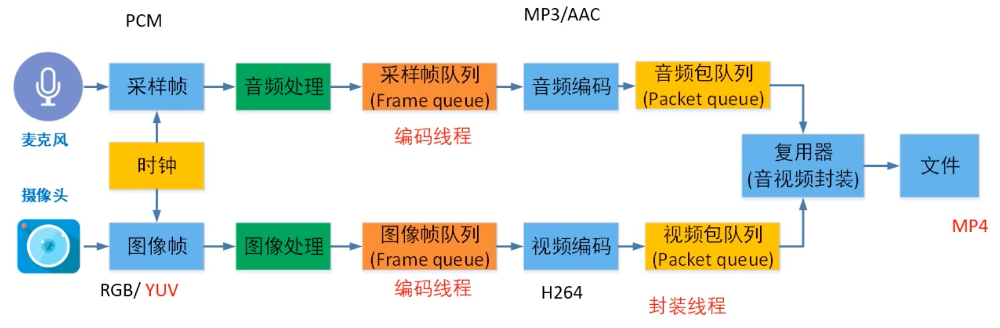

## 基础知识

### 软编解码与硬编解码区别

```java
软编解码：依靠cpu运算进行编解码
  优点：兼容性好；可调节编解码效率。
  缺点：耗电量大；设备容易发热。
硬编解码：依靠设备中的编解码硬件进行编解码
  优点：减少cpu负担（耗电量降低、减少发热）
  缺点：兼容性问题（每个设备的硬件各有不同，有好有坏）；无法调节编解码效率（编解码程序固化好了，固定效率）
  
软编解码比硬编解码性能要好，现在的cpu性能已经是非常强悍的了。而硬编解码效率是固定的，只能每秒解码多少帧就是多少帧，不会多不会少。
硬编解码好处是在于开销比较少，因为它固化的程序，不用做指令转换。如何是cpu做软解码，还需要cpu将指令转换为cpu电路。 
```


### 视频（帧率、码率、分辨率、颜色空间）

```java
1、帧率（fps）：帧/秒
视频由一系列图片构成的，视频帧表示一张画面。
帧率就是单位时间内帧的数量，单位为：帧/秒 或 fps（frames per second）
  帧率的一般以下几个典型值：
  24/25 fps：1秒24/25帧，一般的电影帧率。
  30/60 fps：1秒30/60帧，游戏的帧率，30帧可以接受，60帧会感觉更加流畅逼真。
  85 fps以上人眼基本无法察觉出来了，所以更高的帧率在视频里没有太大意义。
  
  
码率（码流率）：kb/s
指视频文件在单位时间内使用的数据流量。码率越大，说明单位时间内采样率越大，数据流的精度越高。
1kbs 表示 每秒有1000位数据
  
  
分辨率：视频图像展示的大小
  
 
色彩空间（常见的就两种，RGB、YUV）：
1、RGB：通过R G B三种基础色，可以混合出所有的颜色
  
2、YUV（也叫YCbCr）：一种亮度与色度分离的色彩格式（早期电视都是黑白的只有Y，后面有了彩色电视加入了UV两种色度）
  Y：亮度，就是灰度值。除了表示亮度信号外，还含有较多的绿色通道量。
	U：蓝色通道与亮度的差值。
	V：红色通道与亮度的差值。
  
RGB与YUV的转换公式：
Y = 0.299R ＋ 0.587G ＋ 0.114B 
U = －0.147R － 0.289G ＋ 0.436B 
V = 0.615R － 0.515G － 0.100B 
—————————————————— 
R = Y ＋ 1.14V 
G = Y － 0.39U － 0.58V 
B = Y ＋ 2.03U
```


#### 为什么视频编码用YUV而不用RGB？

```java
YUV能更好地去除冗余信息
  
人眼是对亮度敏感，对色度不敏感，因此减少部分UV的数据量，人眼却无法感知出来，这样可以通过压缩UV的
分辨率，在不影响观感的前提下，减小视频的体积。
  
压缩算法往往会先把RGB转换成YUV，对Y少压，对UV多压，来平衡图像的效果与压缩率。
```


#### 不同的YUV格式（YUV444、YUV422、YUV420）

```java
YUV存储方式分为两大类（pakced存储方式已经非常少用，大部分视频都是采用planar存储方式。）
planar：先存储所有Y，紧接着存储所有U，最后是存储所有V 
packed：每个像素点的 Y、U、V 连续交叉存储

由于人眼对色度敏感度低，所以通过省略一些色度信息，即亮度共用一些色度信息，进而节省存储空间。
因此，planar又区分了以下几种格式：
YUV444：4:4:4采样，每一个Y对应一组UV分量
YUV422：4:2:2采样，每两个Y共用一组UV分量
YUV420（最常用）：4:2:0采样，每四个Y共用一组UV分量
  YUV420又分两种类型：
    YUV420P：三平面存储。数据组成为YYYYYYYYUUVV（如I420）或YYYYYYYYVVUU（如YV12）
    YUV420SP：两平面存储。分为两种类型YYYYYYYYUVUV（如NV12）或YYYYYYYYVUVU（如NV21）
  
一般android摄像头输出为NV21格式，而I420格式则是大多数编码器默认输入输出格式。
可以通过公式将NV21转成I420的。
```


### 音频（采样率、采样大小、声道、样本类型）

```java
原始音频数据大小 = 采样率 * 采样深度 * 声道数 * 采样时长
44.1kHz * 16位 * 2声道 * 4分钟(4*60秒) = 44100*16*2*4*60 = 33868800bit = 40mb

采样率：采样的频率（一秒钟多少次）
根据奈奎斯特采样定理，采样率要大于原声波频率的2倍。
人耳能听到的最高频率为20kHz，所以为了满足人耳的听觉要求，采样率至少为40kHz。通常为44.1kHz，更高的通常为48kHz。
22khz：无线广播
44.1khz：cd质量
48khz：数字电视、dvd
96khz：蓝光、高清dvd
192khz：蓝光、高清dvd
  
 
采样大小：每个样本的大小，通常有8位、16位、32位。
位数越多，记录的值越准确，还原度越高。
  
  
声道：指支持能不同发声（注意是不同声音）的音响的个数。
单声道：1个声道 
双声道：2个声道 
立体声道：默认为2个声道 
立体声道（4声道）：4个声道  
  

采样类型：声音样本是按声道来存储的，比如双声道（左声道、右声道）
交错模式：先存储一个左声道声音样本，再存储一个右声道声音样本
  LRLRLRLR....
非交错模式：先记录一个周期内所有左声道样本，然后再记录所有右声道样本
  LLLL...RRRR...
  
  
比特率：每秒传输的位数，间接衡量声音质量的一个标准。
没有压缩的声音，它的比特率 = 采样率*采样深度*声道数
  
码率：压缩后的音频数据的比特率。比特率越大，压缩效率越低，音质越好。
码率 = 声音文件大小/时长
96kbps：fm质量
128-160kbps：一般音频质量
192kbps：cd质量
256-320kbps：高质量音频
```


#### 什么声音？声音怎么保存？

```java
声音是由物体振动产生，这种振动引起了周围空气压强的振荡。我们称这种振荡函数表现形式位波形。

声音是一种波，有自己的振幅和频率，那么要保存声音，就要保存声音在各个时间点上的振幅。
而数字信号并不能连续保存所有时间点的振幅，事实上，并不需要保存连续的信号，就可以还原到人耳可接受的声
音。
根据奈奎斯特采样定理：为了不失真地恢复模拟信号，采样频率应该不小于模拟信号频谱中最高频率的2倍。
  
声音怎么保存？- 声音数字化，就是转换为数字信号
在自然界中，声音是连续不断的，是一种模拟信号。需要把声音转换为数字信号，才能保存。
  
音频数据的承载方式最常用的是脉冲编码调制，即PCM。

PCM的采集步骤分为以下步骤：
模拟信号->采样->量化->编码->数字信号
```


## 音视频编解码

```java
flv、mkv、mp4、avi等视频文件可以理解为一个容器，里边存放着音视频压缩后的码流。

mp4 = 封装头 + 压缩后的视频流 + 压缩后的音频流
解封装：提取封装头、提取压缩后的视频流、提取压缩后的音频流
解码：将 压缩后的视频流 解码成 图像数据（压缩后的音频流 -> pcm） 
```




### 音视频为什么要进行编码？- 编码目的是压缩

```java
视频是连续的图像序列，由连续的帧构成，一帧就是一张图像，当帧序列以一定的速率进行播放，就形成了视频。
这么多连续的图像数据，如果不进行压缩那么数据量是非常大的。
例如：
 一个1920x1080分辨率，32位（4字节），每秒30帧的视频。
 一秒钟图像序列需要占用的大小为：1920x1080x4x30 = 248832000字节（大约237mb）
```


### 如何进行数据压缩？核心是去除冗余信息

```java
那么如何进行数据压缩？核心是去除冗余信息
空间冗余：一帧的图像内部，相邻像素之间存在较强的相关性造成的冗余
  例如：图像内某个区域的像素都是由相同色值像素构成的（存在冗余），可以使用 区域大小位置+1个像素值 代表该区域
时间冗余：图像序列种不同帧之间的相关性造成的冗余
  例如：帧与帧之间存在大量相似的地方（存在冗余），可以只保留差异的地方就好了。
视觉冗余：人眼感知不到的那部分信息
  例如：颜色太过于丰富了，可以降低一点
熵冗余：编码冗余
  例如：aaaabbbb存在冗余，可以使用a4b4表示
...
```


## H264（AVC）

```java
视频编码格式有很多，主流的就是H264、H265。
视频编码格式是由国际上多个组织联合发布的，所有不同组织叫的名字就不同。
ITU-T组织叫 H264，ISO组织叫 MPEG-4 AVC（所以 H264 == AVC）
ITU-T组织叫 H265，ISO组织叫 HEVC（所以 H265 == HEVC）
  
像在android MedioCodec里边找不到H264/H265编码格式的，但是有 
MediaFormat.MIMETYPE_VIDEO_AVC 以及 MediaFormat.MIMETYPE_VIDEO_HEVC，它们就是H264/H265编码
```


### IPB帧 - 解决时间冗余

```java
H264会根据一段时间内，画面的变化情况，选取一帧画面作为完整编码，下一帧只记录与上一帧完整数据的差别，是一个动态压缩的过程。
  
I帧：关键帧。可以看做作图像经过压缩之后的产物，可以单独解码成一个完整的图像。
P帧：向前预测帧。记录着本帧跟之前的一个I帧（或P帧）的差别，解码时需要用到之前缓存的画面叠加上本帧定义的差别，生成最终图像。
B帧：双向预测帧。记录着本帧与前后帧的差别，解码时需要参考前面一个I帧（或P帧），同时也需要参考后面的P帧才能生成最终图像。
```


### 视频编码层VCL & 网络抽象层NAL

```java
视频编码层VCL：视频数据的内容
网络抽象层NAL：格式化数据并提供头信息
  
NAL单元：每帧数据就是NAL单元（SPS、PPS除外）
在h264数据帧中，帧开头都会带 00 00 00 01 或 00 00 00 01分隔符。
一般来说编码器编出来的首帧数据位PPS与SPS，接着为i帧。
```


### GOP（图像组） 和 IDR

```java
GOP（图像组）：Group of picture。指一组变化不大的视频帧。

IDR：GOP的第一帧，并且还是关键帧
IDR都是I帧，可以防止一帧解码出错，导致后面所有帧解码出错的问题。当解码器在解码到IDR的时候，会将之前的
参考帧清空，重新开始一个新的序列，这样，即便前面一帧解码出现重大错误，也不会蔓延到后面的数据中。
  
注：关键帧都是I帧，但是I帧不一定是关键帧
```


## 音频编码

### AAC编码格式

```java
音频也有许多的编码格式，如：WAV、MP3、WMA、APE、FLAC等等，特别是后两种无损压缩格式。

AAC是音频有损压缩技术，一种高压缩比的音频压缩算法。
在MP4视频中的音频数据，大多数时候都是采用AAC压缩格式。
  
AAC格式主要分为两种:
ADIF：Audio Data Interchange Format。音频数据交换格式。
  这种格式的特征是可以确定的找到这个音频数据的开始，不需进行在音频数据流中间开始的解码，即它的解码必须在明确定义的开始处进行。这种格式常用在磁盘文件中。
ADTS：Audio Data Transport Stream。音频数据传输流。
  这种格式的特征是它是一个有同步字的比特流，解码可以在这个流中任何位置开始。它的特征类似于mp3数据流格式。
  ADTS可以在任意帧解码，它每一帧都有头信息。ADIF只有一个统一的头，所以必须得到所有的数据后解码。且这两种的header的格式也是不同的，目前一般编码后的都是ADTS格式的音频流。
```

