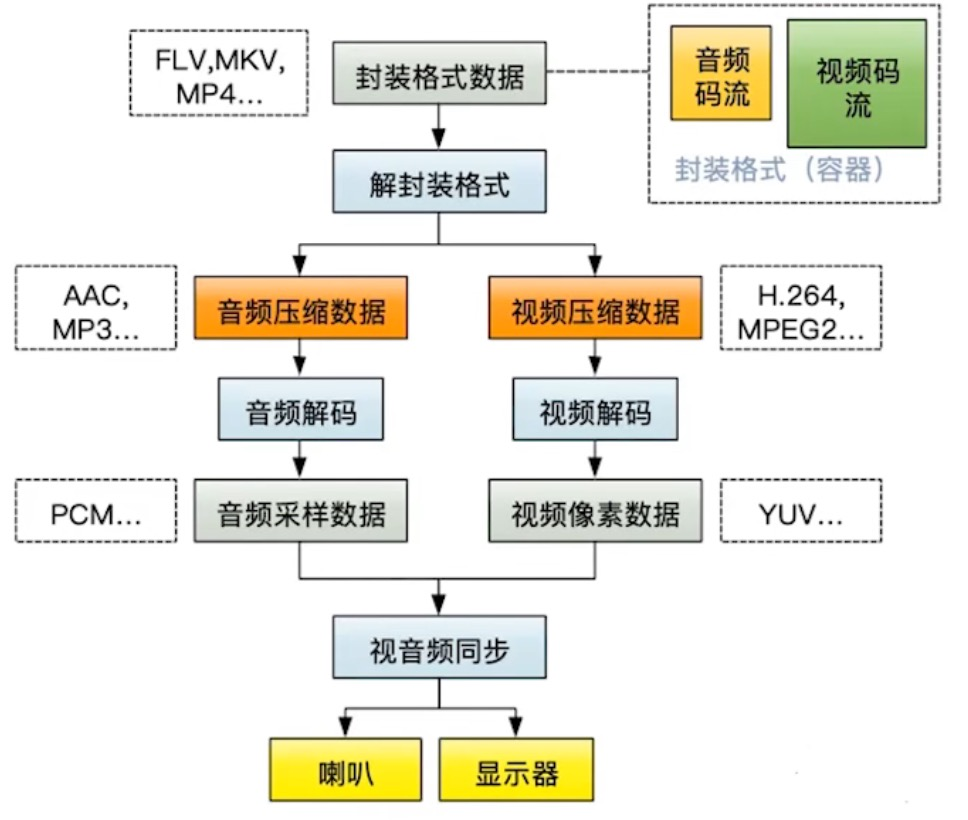

## Vap

### vap特色

#### vap与svga相比优缺点

```java
svga：序列帧来实现礼物动画效果
  优点：
  	① 小动画的播放效率比较高（播放原理就是在canvas上对svga图像进行对应的位移、形变等操作）
    ② 兼容性好（不涉及到硬件解码）
  缺点：在大动画上：文件体积大（无法很好地压缩数据）；占用内存大（解析之后是大量的帧信息以及svg图像bitmap）

vap：
  优点：mp4文件体积小（h264编码）；解码效率高（硬解码，有专门的硬件做这个事情）;
  缺点：由于是硬解码，依赖硬件可能存在兼容性问题（有些设备不支持硬编码器）。
```


#### vap如果让mp4格式支持透明通道

```java
https://zhuanlan.zhihu.com/p/356719736?ivk_sa=1024320u

mp4是不支持透明的：
图像透明使用Alpha通道表示，即ARGB里的A，该通道是一个8位灰度通道，由256级灰度来记录图像中的透明信息。
由于mp4是用h264编码的，颜色空间使用的是YUV，而YUV只能转为RGB，无法转ARGB，就导致了mp4是不支持透明的。
  
但是礼物动效大部分都是透明背景的，所有如何用mp4，就必须支持透明。
  
vap的做法：
使用两个视频合二为一。其中一个视频在RGB通道里存储Alpha的值，另外一个视频保留原始的RGB信息。
解码的时候，利用OpenGL将两个视频数据提取，将这些数据合成为ARGB图像（带透明通道的图像）
```


### 基本概念

```java
//使用：
animView.setFetchResource(object : IFetchResource { //填充融合图片或文字
            override fun fetchImage(resource: Resource, result: (Bitmap?) -> Unit) {
                val srcTag = resource.tag
                if (srcTag == "[sImg1]") {
                    val drawableId = if (head1Img) R.drawable.head1 else R.drawable.head2
                    head1Img = !head1Img
                    val options = BitmapFactory.Options()
                    options.inScaled = false
                    result(BitmapFactory.decodeResource(resources, drawableId, options))
                } else {
                    result(null)
                }
            }
            override fun fetchText(resource: Resource, result: (String?) -> Unit) {  ... }
  
            override fun releaseResource(resources: List<Resource>) { ... }
        })
animView.startPlay(file) //设置vap文件，并开始播放
  
//加载流程概要：
AnimView#startPlay 
  -> AnimPlayer#startPlay
  	 ① 初始化HardDecoder、AudioPlayer。HardDecoder用于视频解码，AudioPlayer用于音频解码
     ② 初始化Decoder里边的两个线程（都是HandlerThread，一个用来渲染，一个用来解码）
     ③ 读取vap文件头信息，校验vap文件合法性 以及 提取写在文件里边的配置信息（json格式）
     ④ 开始解码（AnimPlayer#innerStartPlay）
  -> AnimPlayer#innerStartPlay
  	 decoder?.start(fileContainer) //视频解码
     audioPlayer?.start(fileContainer) //音频解码 
```


#### 注意点：解析vap配置信息过程，可能存在OOM风险。

```java
//AnimConfigManager#parse 函数中，作者也有提醒
val vapcBuf = ByteArray(head.length - 8) // ps: OOM exception
    
如果vap动效涉及的融合元素较多，并且融合元素的参与帧较长，会导致该json配置信息非常的大。
原因是vap json配置信息除了保存视频相关的信息外，如果有融合元素，会记录融合元素的key、类型等信息，并且还会记录该元素在每个关键帧中的位置信息，导致json会非常的大。
```


### 视频解码流程 - HardDecoder.kt

```java
//HardDecoder#startPlay
① 创建MediaExtractor（提取器），并绑定提取的目标文件
② 提取器寻找视频轨道下标，选中轨道，提取该视频轨道的格式信息
③ 创建一个名叫 glTexture 的 SurfaceTexture，并且设置监听 setOnFrameAvailableListener
④ 创建MediaCodec（解码器），给解码器绑定上 Surface(glTexture)，启动解码器
⑤ 开始解码视频
  while(true){
    //提取器 -> input队列
    ① 从input队列中申请有效的缓冲区下标 index = decoder.dequeueInputBuffer(TIMEOUT_USEC)
    ② 通过下标拿到对应的缓冲区 ByteBuffer buffer = decoder.getInputBuffers()[index]
    ③ 提取器读取样本数据到缓存区 size = extractor.readSampleData(buffer, 0)
    ④ 将填满数据的缓冲区加入到input队列 decoder.queueInputBuffer(index, 0, size, extractor.getSampleTime(), 0);

    //解码过程由MediaCodec完成，它就是从input队列拿到数据，解码之后，放到output队列
    ⑤ 处理output队列，提取output缓冲区信息 decoderStatus = decoder.dequeueOutputBuffer(bufferInfo, TIMEOUT_USEC)
    ⑥ 更新当前帧下标，frameIndex 应该是记录i帧的index
    ⑦ 检查是否解码完成，如何解码完成，判断是否loop（有可能这个vap不止播放一次）
    ...
	}
⑥ 解码后的数据都会去到glTexture，当有新的图像buffer到来，SurfaceTexture就会回调 OnFrameAvailableListener#onFrameAvailable 通知业务层。
⑦ 在 onFrameAvailable 中做了三个操作：
   ① 调用 updateTexImage 将新的图像buffer更新到纹理。
   ② PluginManager#onRendering 通知动画插件（MaskAnimPlugin、MixAnimPlugin），让插件们处理图像。
   ③ Render#swapBuffers() 最后将处理好的图像，展示到 TextureView 的 SurfaceTexture。
```


### 音频解码流程 - AudioPlayer.kt

```java
AudioTrack是播放pcm音频数据的api。所以它只能播放解码后的数据（MediaPlayer是播放编码格式的音频文件的，因为MediaPlayer包含了解码逻辑）
vap框架就是使用AudioTrack播放解码后的pcm数据

//AudioPlayer#startPlay
① 创建MediaExtractor（提取器），并绑定提取的目标文件
② 提取器寻找音频轨道下标，选中轨道，提取该音频轨道的格式信息（如果这个vap带音频轨道的话，就会继续往下执行）
③ 创建MediaCodec（解码器）
④ 开始解码音频
  while(true){
    //获取input缓冲区，将要解码的数据填入缓冲区，再将缓冲区加入到input队列里边
    //获取output缓冲区，将MediaCodec完成解码后的pcm数据，写入到AudioTrack进行播放
    ...
	}
```


### 支持透明通道流程 - MaskAnimPlugin

```java
将rgb视频和透明图层视频分离，两个视频的像素数据合并重新计算（rgb + a），生成argb像素数据，让视频支持透明通道
```


### 元素融合流程 - MixAnimPlugin

```java
将元素（bitmap、text）转成纹理，在帧率更新的时候读取json配置，查看元素对应信息，看看是否需要在当前帧融入该元素。

视频内容无法直接实现属性的插入，只能曲线救国，通过对属性图片进行修剪，欺骗用户的眼睛，让其看起来像是在视频内容里，实现最终的融合效果（效果如文章开头展示）。

为实现属性图片处理，需要引入“遮罩”素材，利用遮罩与属性图片进行Porter-Duff操作，就能得到需要的形状
再将结果贴到视频对应坐标位置，就能实现最后的融合效果。
“遮罩”素材保存在每一帧视频内容里，之前通过缩小Aplha区域，空出来的区域得到利用。
```


## OpenGL ES

```java
着色器 Shader（运行在gpu上的小程序）：执行 先画顶点再进行上色，所有是先执行vsh再执行fsh
vsh：vertex shader（顶点着色器）：作用是画形状
fsh：fragment shader（片着色器）：作用是上色、贴图
  
正常色器代码是写成.vsh、.fsh文件，放到raw文件夹里边的
也可以直接将着色器代码写到代码里边
  
  
opengl世界坐标（中心点0,0）
-1, 1   0, 1   1, 1
-1, 0   0, 0   1, 0
-1,-1   0,-1   1, -1
  
纹理坐标（第一象限）
0,1  1,1
0,0  1,0
  
  
着色器代码语法：
//attribute：定义的变量内容可以从java传递进来
//varying：定义的变量可以在任意地方使用，也就是vsh定义，fsh也能使用
  
//====== 一个vsh
//定义变量vPosition float[4]，这里需要用它来表示一个顶点(一个顶点有xyzw的坐标)
attribute vec4 vPosition;
attribute vec2 vCoor; //代表纹理坐标
varying vec2 aCoor; 
void main(){
  gl_Position = vPosition; //gl_Position是内置变量，这里是把坐标点赋值给gl_Position
  aCoor = vCoor; //vCoor赋值给aCoor
}

//====== 一个fsh
#extension GL_OES_EGL_image_external : require //扩展纹理
precision mediump float; //数据精度
varying vec2 aCoor; //跟vsh定义的一样，vsh的aCoor会传递过来
uniform samplerExternalOES vTexture; //samplerExternalOES：采样器（可以看做图片，接收java的每一帧图片）
void main(){
  //texture2D函数：从vTexture采样器里边采样一个RGBA值的像素值，aCoor这个像素点的RGBA值 
  gl_FragColor = texture2D(vTexture, aCoor);
}

```


## Android硬编解码API - MediaCodec

```java
MediaCodec - 编解码器（编码、解码）
  
MediaMuxer - 混合器（生成音频、视频或音视频混合文件）
  
MediaExtracto - 提取器（从容器中提取出不同轨道的数据，例如从mp4中提取视频轨道和音频轨道）
 
MediaCodec 生产者（input队列）- 消费者（output队列）
编码：相机采集数据 -> input队列 -> 编码 -> output队列 -> 混合器（生成mp4文件）
解码：mp4文件 -> 提取器（提取轨道）-> input队列 -> 解码 -> output队列 -> surface（显示）

解码：
//绑定surface
decoder.configure(format, surface, null, 0);
decoder.start();
while(true){
  //提取器 -> input队列
  ① 从input队列中申请有效的缓冲区下标 index = decoder.dequeueInputBuffer(TIMEOUT_USEC)
  ② 通过下标拿到对应的缓冲区 ByteBuffer buffer = decoder.getInputBuffers()[index]
  ③ 提取器读取样本数据到缓存区 size = extractor.readSampleData(buffer, 0)
  ④ 将填满数据的缓冲区加入到input队列 decoder.queueInputBuffer(index, 0, size, extractor.getSampleTime(), 0);
  
  //解码过程由MediaCodec完成，它就是从input队列拿到数据，解码之后，放到output队列
  //由于MediaCodec绑定了surface，所以会自动将解码后的数据，输出到surface中进行播放
  ...
}
```


## 视频基础知识

### 帧率（fps）

```java
视频：由一系列图片构成的
视频帧：表示一张画面
帧率：即单位时间内帧的数量，单位为：帧/秒 或 fps（frames per second）
  帧率的一般以下几个典型值：
  24/25 fps：1秒24/25帧，一般的电影帧率。
  30/60 fps：1秒30/60帧，游戏的帧率，30帧可以接受，60帧会感觉更加流畅逼真。
  85 fps以上人眼基本无法察觉出来了，所以更高的帧率在视频里没有太大意义。
```


### 码率

```java
数据传输时单位时间传送的数据位数，1kbs即每秒有1000位数据。
```


### 色彩空间（常见的就两种，RGB、YUV）

```java
1、RGB：通过R G B三种基础色，可以混合出所有的颜色
  
2、YUV（也叫YCbCr）：一种亮度与色度分离的色彩格式（早期电视都是黑白的只有Y，后面有了彩色电视加入了UV两种色度）
  Y：亮度，就是灰度值。除了表示亮度信号外，还含有较多的绿色通道量。
	U：蓝色通道与亮度的差值。
	V：红色通道与亮度的差值。
  
RGB与YUV的转换公式：
Y = 0.299R ＋ 0.587G ＋ 0.114B 
U = －0.147R － 0.289G ＋ 0.436B 
V = 0.615R － 0.515G － 0.100B 
—————————————————— 
R = Y ＋ 1.14V 
G = Y － 0.39U － 0.58V 
B = Y ＋ 2.03U
```


#### 为什么用YUV而不用RGB？

```java
YUV能更好地去除冗余信息
  
人眼是对亮度敏感，对色度不敏感，因此减少部分UV的数据量，人眼却无法感知出来，这样可以通过压缩UV的
分辨率，在不影响观感的前提下，减小视频的体积。
  
压缩算法往往会先把RGB转换成YUV，对Y少压，对UV多压，来平衡图像的效果与压缩率。
```


#### 不同的YUV存储格式

```java
YUV存储方式分为两大类（pakced存储方式已经非常少用，大部分视频都是采用planar存储方式。）
planar：先存储所有Y，紧接着存储所有U，最后是存储所有V 
packed：每个像素点的 Y、U、V 连续交叉存储

由于人眼对色度敏感度低，所以通过省略一些色度信息，即亮度共用一些色度信息，进而节省存储空间。
因此，planar又区分了以下几种格式：
YUV444：4:4:4采样，每一个Y对应一组UV分量
YUV422：4:2:2采样，每两个Y共用一组UV分量
YUV420（最常用）：4:2:0采样，每四个Y共用一组UV分量
  YUV420又分两种类型：
    YUV420P：三平面存储。数据组成为YYYYYYYYUUVV（如I420）或YYYYYYYYVVUU（如YV12）
    YUV420SP：两平面存储。分为两种类型YYYYYYYYUVUV（如NV12）或YYYYYYYYVUVU（如NV21）
  
一般android摄像头输出为NV21格式，而I420格式则是大多数编码器默认输入输出格式。
可以通过公式将NV21转成I420的。
```


## 音频基础知识

```java
音频数据的承载方式最常用的是脉冲编码调制，即PCM。
  
声音怎么保存？- 声音数字化，就是转换为数字信号
在自然界中，声音是连续不断的，是一种模拟信号。需要把声音转换为数字信号，才能保存。

声音是一种波，有自己的振幅和频率，那么要保存声音，就要保存声音在各个时间点上的振幅。
而数字信号并不能连续保存所有时间点的振幅，事实上，并不需要保存连续的信号，就可以还原到人耳可接受的声
音。
根据奈奎斯特采样定理：为了不失真地恢复模拟信号，采样频率应该不小于模拟信号频谱中最高频率的2倍。

PCM的采集步骤分为以下步骤：
模拟信号->采样->量化->编码->数字信号
```


### 采样率 和 采样位数

```java
采样率：采样的频率
根据奈奎斯特采样定理，采样率要大于原声波频率的2倍。
人耳能听到的最高频率为20kHz，所以为了满足人耳的听觉要求，采样率至少为40kHz。通常为44.1kHz，更高的通常为48kHz。
  
采样位数：涉及到上面提到的振幅量化。波形振幅在模拟信号上也是连续的样本值，而在数字信号中，信号一般是不
连续的，所以模拟信号量化以后，只能取一个近似的整数值，为了记录这些振幅值，采样器会采用一个固定的位数来
记录这些振幅值，通常有8位、16位、32位。
8位：0-255
16位：-32768-32767
32位：-2147483648-2147483647
位数越多，记录的值越准确，还原度越高。

最后就是编码了。由于数字信号是由0，1组成的，因此，需要将幅度值转换为一系列0和1进行存储，也就是编码，
最后得到的数据就是数字信号：一串0和1组成的数据。
```


### 声道数

```java
声道数：指支持能不同发声（注意是不同声音）的音响的个数。
单声道：1个声道 
双声道：2个声道 
立体声道：默认为2个声道 
立体声道（4声道）：4个声道
```


### 码率

```java
码率：指一个数据流中每秒钟能通过的信息量，单位bps（bit per second）
码率 = 采样率 * 采样位数 * 声道数
```


## 音视频编解码概要图

flv、mkv、mp4、avi等视频文件可以理解为一个容器，里边存放着音视频压缩后的码流。

如果想要播放该视频文件，就需要将压缩后的数据进行解码生成原始数据，给系统播放。




## 音视频为什么要进行编解码？- 编码目的是压缩

```java
视频是连续的图像序列，由连续的帧构成，一帧就是一张图像，当帧序列以一定的速率进行播放，就形成了视频。
这么多连续的图像数据，如果不进行压缩那么数据量是非常大的。
例如：
 一个1920x1080分辨率，32位（4字节），每秒30帧的视频。
 一秒钟图像序列需要占用的大小为：1920x1080x4x30 = 248832000字节（大约237mb）
```


### 如何进行数据压缩？核心是去除冗余信息

```java
那么如何进行数据压缩？核心是去除冗余信息
空间冗余：一帧的图像内部，相邻像素之间存在较强的相关性造成的冗余
  例如：图像内某个区域的像素都是由相同色值像素构成的（存在冗余），可以使用 区域大小位置+1个像素值 代表该区域
时间冗余：图像序列种不同帧之间的相关性造成的冗余
  例如：帧与帧之间存在大量相似的地方（存在冗余），可以只保留差异的地方就好了。
视觉冗余：人眼感知不到的那部分信息
  例如：颜色太过于丰富了，可以降低一点
熵冗余：编码冗余
  例如：aaaabbbb存在冗余，可以使用a4b4表示
...
```


## 视频编码

### H264编码格式

```java
视频编码格式有很多，比如H26x系列和MPEG系列的编码。主流的就是H264、H265。

视频编码是由国际上多个组织联合发布的，所有不同组织叫的名字就不同。
例如：
ITU-T组织叫 H264，ISO组织叫 MPEG-4 AVC（ H264 == AVC）
ITU-T组织叫 H265，ISO组织叫 HEVC（ H265 == HEVC）
像在android MedioCodec里边找不到H264/H265编码格式的，但是有 
MediaFormat.MIMETYPE_VIDEO_AVC 以及 MediaFormat.MIMETYPE_VIDEO_HEVC，它们就是H264/H265编码
```


### IPB帧 - 解决时间冗余

```java
H264会根据一段时间内，画面的变化情况，选取一帧画面作为完整编码，下一帧只记录与上一帧完整数据的差别，是一个动态压缩的过程。
  
I帧：关键帧。可以看做作图像经过压缩之后的产物，可以单独解码成一个完整的图像。
P帧：向前预测帧。记录着本帧跟之前的一个I帧（或P帧）的差别，解码时需要用到之前缓存的画面叠加上本帧定义的差别，生成最终图像。
B帧：双向预测帧。记录着本帧与前后帧的差别，解码时需要参考前面一个I帧（或P帧），同时也需要参考后面的P帧才能生成最终图像。
```


### GOP（图像组） 和 IDR

```java
GOP（图像组）：Group of picture。指一组变化不大的视频帧。

IDR：GOP的第一帧，并且还是关键帧
IDR都是I帧，可以防止一帧解码出错，导致后面所有帧解码出错的问题。当解码器在解码到IDR的时候，会将之前的
参考帧清空，重新开始一个新的序列，这样，即便前面一帧解码出现重大错误，也不会蔓延到后面的数据中。
  
注：关键帧都是I帧，但是I帧不一定是关键帧
```


## 音频编码

### AAC编码格式

```java
音频也有许多的编码格式，如：WAV、MP3、WMA、APE、FLAC等等，特别是后两种无损压缩格式。

AAC是音频有损压缩技术，一种高压缩比的音频压缩算法。
在MP4视频中的音频数据，大多数时候都是采用AAC压缩格式。
  
AAC格式主要分为两种:
ADIF：Audio Data Interchange Format。音频数据交换格式。
  这种格式的特征是可以确定的找到这个音频数据的开始，不需进行在音频数据流中间开始的解码，即它的解码必须在明确定义的开始处进行。这种格式常用在磁盘文件中。
ADTS：Audio Data Transport Stream。音频数据传输流。
  这种格式的特征是它是一个有同步字的比特流，解码可以在这个流中任何位置开始。它的特征类似于mp3数据流格式。
  ADTS可以在任意帧解码，它每一帧都有头信息。ADIF只有一个统一的头，所以必须得到所有的数据后解码。且这两种的header的格式也是不同的，目前一般编码后的都是ADTS格式的音频流。
```

